<div align="center">

# 🚗 Go Garagi — Product Requirements Document (PRD)

### The Automotive Super-App for the MENA Region & Beyond

**Car Service · Car Wash · Accident Repair Bidding · Insurance Networks · Spare-Parts Marketplace · Recovery**


</div>

---

## 📄 Document Control

| Field | Value |
|---|---|
| **Product** | Go Garagi Super-App |
| **Document Type** | Product Requirements Document (PRD) |
| **Version** | 1.1 |
| **Status** | ✅ Approved for Build |
| **Author** | Product & Engineering |
| **Audience** | Founders · Product · Engineering · Design · Ops · Investors |
| **Companion Doc** | `Go_Garagi_RFC.md` (Technical Design & Architecture) |
| **Garage prototype** | `go-garagi-garages` — local Garage OS demo (see §11 + Appendix) |
| **Confidentiality** | Internal — Commercially Sensitive |

### Change Log

| Ver | Date | Author | Change |
|---|---|---|---|
| 0.1 | — | Product | Initial MVP feature list & wireframe notes |
| 1.0 | — | Product & Eng | Full production-ready PRD: personas, epics, user stories, journeys, flow diagrams, metrics, monetization, compliance, roadmap |
| **1.1** | 2026-08-01 | Product & Eng | Garage web prototype parity: expanded Garage OS screens, conflict scheduling + suggest-time, `awaiting_customer`, in-app notifications, reports/earnings filters, 6-locale i18n + RTL |

> [!NOTE]
> This PRD is the **single source of truth** for MVP delivery. Every epic carries user stories with **Gherkin acceptance criteria**, priority (MoSCoW), and success metrics. The technical realization of these requirements lives in the companion **RFC**.

---

## 🧭 Table of Contents

1. [Executive Summary](#1--executive-summary)
2. [Market Opportunity](#2--market-opportunity)
3. [Competitive Landscape & Differentiation](#3--competitive-landscape--differentiation)
4. [Product Vision, Strategy & Moats](#4--product-vision-strategy--moats)
5. [Personas](#5--personas)
6. [Goals & Success Metrics](#6--goals--success-metrics-north-star)
7. [MVP Scope (MoSCoW)](#7--mvp-scope-moscow)
8. [Epics, User Stories & Acceptance Criteria](#8--epics-user-stories--acceptance-criteria)
9. [End-to-End User Journeys](#9--end-to-end-user-journeys)
10. [Flow Diagrams & State Machines](#10--flow-diagrams--state-machines)
11. [Information Architecture & Screen Inventory](#11--information-architecture--screen-inventory)
12. [Wireframe Annotations](#12--wireframe-annotations)
13. [Non-Functional Requirements](#13--non-functional-requirements-nfrs)
14. [Trust, Safety & Marketplace Quality](#14--trust-safety--marketplace-quality)
15. [Monetization & Business Model](#15--monetization--business-model)
16. [Analytics & Instrumentation](#16--analytics--instrumentation)
17. [Localization & Compliance](#17--localization--compliance)
18. [Release Plan & Phasing](#18--release-plan--phasing)
19. [Future Roadmap — The Path to #1 Worldwide](#19--future-roadmap--the-path-to-1-worldwide)
20. [Risks & Mitigations](#20--risks--mitigations)
21. [Open Questions & Assumptions](#21--open-questions--assumptions)
22. [Appendix](#22--appendix)

---

## 1. 🎯 Executive Summary

**Go Garagi** is a two-sided **automotive super-app** that unifies the entire car-ownership lifecycle — routine servicing, car wash, accident repair, spare-parts commerce, roadside recovery, and insurance-network access — into a single, trust-first platform for **drivers**, **garages**, **parts sellers**, **recovery partners**, and **insurers**.

> **One-liner:** *Everything your car needs, from one app you can trust — book a service, get competing repair quotes after an accident, buy the right part, and let your insurer's approved network handle the rest.*

### The Wedge

The MENA automotive services market is large, fragmented, and low-trust. Existing apps solve **one slice** each:

- **ServiceMyCar / MySyara** → concierge servicing + parts, but thin on multi-garage competitive bidding and insurer-network depth.
- **GarageBuddy** → AI diagnosis + verified pricing, but not a full marketplace or accident-claim engine.
- **Openbay / RepairPal / YourMechanic (global)** → quote comparison and mobile mechanics, but region-blind (no Arabic-RTL, no GCC insurer integration, no local parts supply).

Go Garagi's differentiator is the **"Accident Quotation Engine"** — a sealed, multi-garage competitive-bidding flow tied directly to **insurer-approved networks** — combined with a genuine **super-app breadth** (service + wash + parts + recovery + chat + payments) and a **Garage Operating System** that makes the supply side sticky.

### What We're Building (MVP) — Five Dedicated Apps

Go Garagi ships as **five separate applications**, one per audience, each with its own tailored experience, identity, and (per the RFC) its own repository and release cadence:

| # | App | Platform | Who | Core Value |
|---|---|---|---|---|
| 1 | 📱 **Customer App** | iOS / Android | Car owners | Discover garages, get accident quotes, book service/wash, buy parts, chat |
| 2 | 🔧 **Garage App** | Web | Garage owners/staff | Garage OS: onboarding, dashboard, bookings (incl. conflict / suggest time), quotes, calendar, services, promotions, reviews, earnings, reports, multi-language UI |
| 3 | 📦 **Supplier App** | Web | Parts sellers | List & manage parts inventory, receive orders/leads, chat, payouts |
| 4 | 🛡️ **Insurance App** | Web | Insurance partners | Manage approved-garage networks, view claim-linked quotes, claim status |
| 5 | ⚙️ **Admin App** | Web | Platform ops | Approve supply, moderate content, analytics, platform settings |

> [!NOTE]
> The Customer, Garage, Supplier, and Insurance apps are the four audience-facing products. The **Admin app is retained as a fifth app** because the platform cannot operate without approvals, moderation, and settings (mandated by the spec's Admin Panel). All five are independently deployable — see **RFC §9 Repository Strategy**.

### Success in 12 Months (North Star)

> **North Star Metric: Completed Jobs per Month** (a "job" = a paid service booking, accepted accident quote, or fulfilled parts order).

Supporting targets: marketplace liquidity (quote fill-rate ≥ 80%), quote-to-booking conversion ≥ 25%, 30-day driver retention ≥ 35%, garage 90-day retention ≥ 70%, CSAT ≥ 4.5/5.

---

## 2. 📈 Market Opportunity

### Market Size & Tailwinds

The global **automotive repair & service** market was valued at roughly **USD 744 billion in 2025** and is projected to approach **USD 1.06 trillion by 2034** (CAGR ~4%), with **Asia-Pacific holding the largest share (~34%)** and the **Middle East** a high-growth frontier driven by a large, aging vehicle parc, harsh operating conditions (heat, dust), and rapid digital adoption *(source: IMARC Group, 2026)*.

The adjacent **automotive repair software** market — the "Garage OS" opportunity Go Garagi captures on the supply side — is growing from **~USD 1.8B (2026) toward USD 2.6B by 2032** at ~6.7% CAGR *(source: Verified Market Reports, 2026)*.

### Why MENA First

| Driver | Implication for Go Garagi |
|---|---|
| **Large expat + high car-ownership base** in GCC | Big, mobile-first, English/Arabic bilingual demand pool |
| **Harsh climate** (heat, sand) | Higher service frequency → repeat usage |
| **Fragmented independent garages** | Huge untapped supply to digitize |
| **Insurer-approved garage networks** are opaque and offline | Clear digitization wedge with B2B2C monetization |
| **Cash-heavy, trust-poor repair transactions** | Transparency + escrow + reviews = defensible value |
| **Government digital push** (RTA, e-invoicing, national IDs) | Rails for compliance-grade product |

### TAM / SAM / SOM (Illustrative Framing)

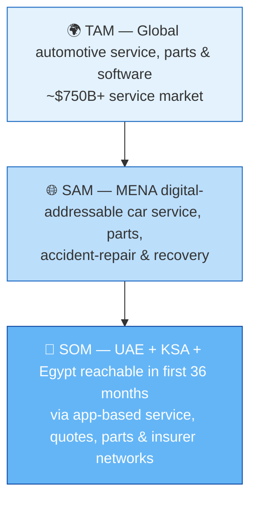

> [!TIP]
> **Positioning statement:** *For car owners in MENA who don't know which garage to trust or what a repair should cost, Go Garagi is the automotive super-app that gives you competing, transparent quotes from verified and insurer-approved garages — unlike single-purpose booking apps, we cover the entire car-ownership lifecycle in one trusted place.*

---

## 3. 🥊 Competitive Landscape & Differentiation

### Feature Comparison Matrix

| Capability | **Go Garagi** | ServiceMyCar | MySyara | GarageBuddy | Openbay / RepairPal | YourMechanic |
|---|:--:|:--:|:--:|:--:|:--:|:--:|
| Routine service booking | ✅ | ✅ | ✅ | ✅ | ✅ | ✅ |
| Car wash & detailing | ✅ | ✅ | ✅ | ➖ | ➖ | ➖ |
| **Multi-garage accident quote bidding (RFP)** | ✅ **Core** | ➖ | ➖ | Partial | ✅ | ➖ |
| **Insurer-approved network integration** | ✅ **Core** | Partial | ➖ | ➖ | ➖ | ➖ |
| Spare-parts marketplace | ✅ | ➖ | ✅ | ➖ | ➖ | ➖ |
| In-app real-time chat | ✅ | Partial | ✅ | ➖ | ➖ | ➖ |
| Roadside recovery / towing | ✅ (Phase 2) | Paid add-on | Partial | ✅ | ➖ | ➖ |
| AI damage estimate / diagnosis | ✅ (Phase 2) | ➖ | ✅ | ✅ | ➖ | ➖ |
| **Garage Operating System (supply SaaS)** | ✅ **Moat** | ➖ | ✅ | ➖ | ➖ | ➖ |
| Transparent upfront pricing + escrow | ✅ | Partial | Partial | ✅ | ✅ | ✅ |
| Arabic RTL + GCC localization | ✅ **Native** | Partial | ✅ | ✅ | ➖ | ➖ |
| BNPL (Tabby / Tamara) | ✅ (Phase 2) | ➖ | ➖ | ➖ | ➖ | ➖ |
| Loyalty & referrals | ✅ (Phase 2) | Partial | ➖ | ✅ (subscription) | ✅ (rewards) | ➖ |

> **Legend:** ✅ Full · Partial · ➖ Not offered

### The Five Differentiation Wedges

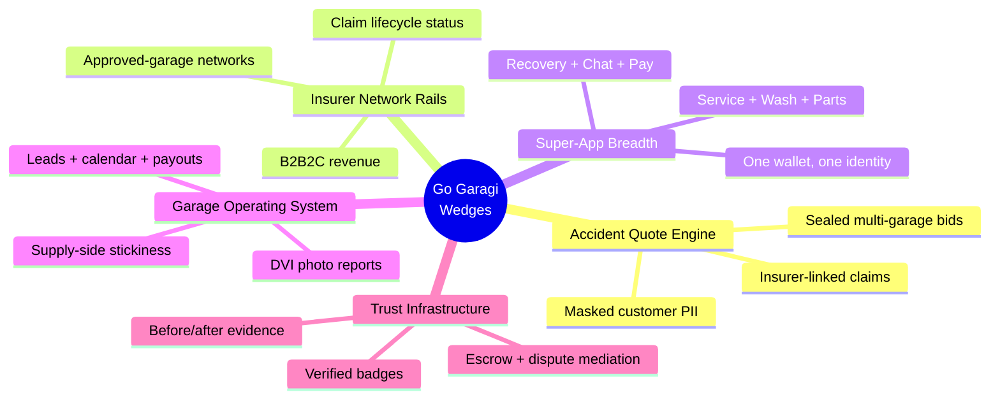

**Why these are defensible:**

1. **Accident Quote Engine** — competitors do *comparison* (Openbay) or *diagnosis* (GarageBuddy); none combine **sealed competitive bidding + insurer claim linkage + PII masking** in the MENA context. This is the network-effect flywheel: more drivers → more RFPs → more garages → faster/cheaper quotes → more drivers.
2. **Insurer Rails** — once insurers publish their approved networks and receive claim-linked quotes through Go Garagi, switching cost is high and we become **infrastructure**, not just an app.
3. **Super-App Breadth** — a single identity, wallet, vehicle-garage, and chat thread spanning service + parts + recovery raises LTV and retention far above single-purpose apps.
4. **Garage OS** — the supply side gets leads *and* a business tool (calendar, DVI reports, payouts, reviews). This mirrors how MySyara OS locked in 2,000+ shops; we go further by bundling demand.
5. **Trust Infrastructure** — verification, escrow, before/after photo evidence, and dispute mediation directly attack the #1 industry pain point: **trust**.

---

## 4. 🌟 Product Vision, Strategy & Moats

### Vision

> *To become the operating system for car ownership worldwide — the single trusted place where every driver's vehicle needs are met and every garage's business runs.*

### Mission (MVP horizon)

Digitize the fragmented MENA car-service market by connecting drivers with **verified, insurer-approved garages** through transparent, competitive, escrow-protected transactions.

### Strategic Pillars

| Pillar | What it means | MVP expression |
|---|---|---|
| **Trust-first** | Every transaction is verifiable & protected | Verified badges, reviews, escrow, dispute flow |
| **Marketplace liquidity** | Match demand & supply fast | Quote fill-rate, response SLAs, smart garage ranking |
| **Supply lock-in** | Make garages depend on us | Garage App = their daily tool |
| **Insurer as a channel** | B2B2C distribution | Approved-network integration |
| **Local, then global** | Win MENA deeply, then scale playbook | Arabic RTL, GCC compliance from day one |

### The Moats (Defensibility Stack)

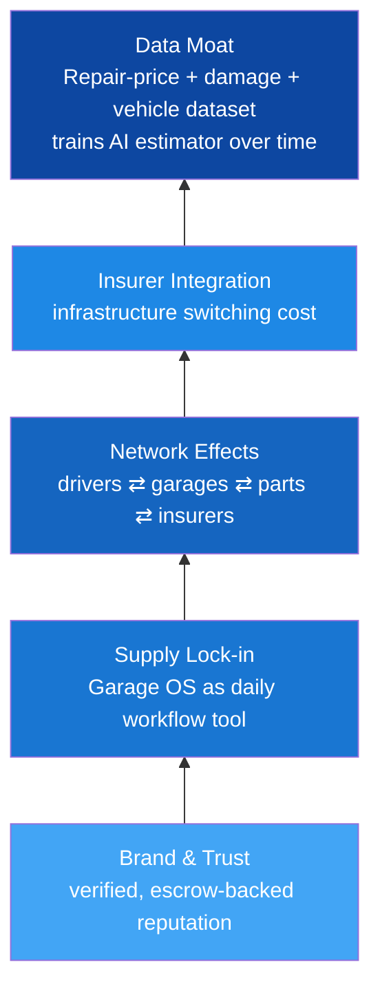

---

## 5. 👥 Personas

### Primary: **Omar — The Busy Car Owner** 🧑‍💼

| Attribute | Detail |
|---|---|
| **Profile** | 34, expat professional in Dubai, owns a 2021 SUV |
| **Goals** | Fast, fair, no-hassle service; trustworthy garages; not get overcharged |
| **Pain points** | Doesn't know a fair price; hates calling around; distrusts garages; accident claims are confusing |
| **Behaviors** | Mobile-first, bilingual (EN/AR), pays by card, reads reviews |
| **Jobs-to-be-done** | *"When my car needs work, help me find a garage I can trust and pay a fair, transparent price."* |
| **Success** | Books/gets a quote in < 3 minutes; feels protected |

### Primary: **Khalid — The Independent Garage Owner** 🔧

| Attribute | Detail |
|---|---|
| **Profile** | 45, owns a 6-bay workshop in Al Quoz, 5 staff |
| **Goals** | Fill idle bays, win insurance jobs, get paid reliably, build reputation |
| **Pain points** | Feast/famine demand, no marketing budget, slow insurer payments, no-shows |
| **Behaviors** | Uses WhatsApp for everything; low digital literacy; price-sensitive |
| **Jobs-to-be-done** | *"Send me qualified jobs and give me a simple tool to manage them."* |
| **Success** | Steady lead flow, quick quote response, on-time payouts |

### Secondary: **Nadia — Insurance Ops Manager** 🛡️

| Attribute | Detail |
|---|---|
| **Goals** | Route claims to approved garages, control repair cost, improve customer NPS |
| **Pain points** | Manual garage coordination, fraud, opaque repair pricing |
| **JTBD** | *"Give my policyholders a digital way to reach my approved network with claim tracking."* |

### Secondary: **Sami — Parts Seller** 📦

| Attribute | Detail |
|---|---|
| **Goals** | Move OEM & aftermarket inventory, reach car owners & garages |
| **Pain points** | Fitment errors → returns, low online reach |
| **JTBD** | *"List my parts with fitment data and connect buyers to me."* |

### Operational: **Layla — Platform Admin / Trust & Safety** 🧑‍⚖️

| Attribute | Detail |
|---|---|
| **Goals** | Keep supply verified, moderate content, monitor marketplace health |
| **JTBD** | *"Approve good garages fast, remove bad actors, and watch the metrics."* |

### Future: **Recovery Partner (Tow Operator)** 🚛 — activated in Phase 2.

---

## 6. 📊 Goals & Success Metrics (North Star)

### North Star

> **⭐ Completed Jobs / Month** — the count of paid service bookings + accepted accident quotes + fulfilled parts orders. It captures value delivered to *both* sides and across *all* verticals.

### Metric Tree (AARRR + Marketplace Liquidity)

| Stage | Metric | MVP Target (12 mo) |
|---|---|---|
| **Acquisition** | Monthly new drivers / garages | 25k drivers · 600 garages |
| **Activation** | % new drivers completing first quote/booking | ≥ 40% |
| **Liquidity** | Quote RFP fill-rate (≥1 response) | ≥ 80% |
| **Liquidity** | Median time-to-first-quote | < 60 min |
| **Conversion** | Quote → accepted booking | ≥ 25% |
| **Conversion** | Service booking completion rate | ≥ 85% |
| **Revenue** | GMV / month | Growth ≥ 15% MoM |
| **Revenue** | Take rate (blended) | 8–12% |
| **Retention** | Driver 30-day retention | ≥ 35% |
| **Retention** | Garage 90-day retention | ≥ 70% |
| **Referral** | Driver referral coefficient (k) | > 0.3 |
| **Quality** | CSAT / app rating | ≥ 4.5 |
| **Trust** | Dispute rate | < 2% of jobs |

### Per-Persona KPIs

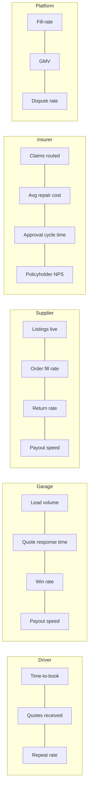

---

## 7. ✅ MVP Scope (MoSCoW)

> [!IMPORTANT]
> MVP = the smallest set that proves the **two-sided flywheel** (drivers get trusted quotes/bookings; garages get manageable leads) with **real payments and trust**. Everything that doesn't serve that is deferred.

### Customer App

| Feature | Priority | In MVP |
|---|:--:|:--:|
| Registration & profile (email/OTP/Google) | **Must** | ✅ |
| Multi-vehicle garage | **Must** | ✅ |
| Garage discovery (map + list + filters) | **Must** | ✅ |
| Garage profile (services, reviews, contact) | **Must** | ✅ |
| **Accident quotation flow (4-step RFP)** | **Must** | ✅ |
| Routine service booking | **Must** | ✅ |
| Car wash booking (service category) | **Must** | ✅ |
| In-app chat | **Must** | ✅ |
| Booking history | **Must** | ✅ |
| Reviews & ratings (write) | **Must** | ✅ |
| Spare-parts marketplace (browse + contact seller) | **Should** | ✅ |
| In-app payments (card) + escrow | **Should** | ✅ |
| Push / SMS / email notifications | **Must** | ✅ |
| Arabic RTL | **Must** | ✅ |
| Recovery/towing | Won't (Phase 2) | ⛔ |
| AI damage estimator | Won't (Phase 2) | ⛔ |
| BNPL, loyalty | Won't (Phase 2) | ⛔ |

### Garage App (Web)

| Feature | Priority | In MVP | Prototype |
|---|:--:|:--:|:--:|
| Registration, profile, service catalog, hours | **Must** | ✅ | ✅ |
| Admin approval gate | **Must** | ✅ | ✅ (simulate) |
| Dashboard KPIs + quick access | **Must** | ✅ | ✅ |
| Booking inbox (accept / reject / suggest time) | **Must** | ✅ | ✅ |
| Conflict scheduling (detect, accept-both, reschedule) | **Must** | ✅ | ✅ |
| Calendar availability (available / booked / blocked / conflict) | **Must** | ✅ | ✅ |
| Manage quote requests (New/Responded/Won/Lost) | **Must** | ✅ | ✅ |
| Submit quote (price, ETA, pickup, notes) | **Must** | ✅ | ✅ |
| Services & pricing CRUD | **Must** | ✅ | ✅ |
| Promotions manager | **Should** | ✅ | ✅ |
| Reviews (view + respond + filters) | **Should** | ✅ | ✅ |
| Payouts & earnings (search / filters) | **Should** | ✅ | ✅ |
| Reports (period + charts) | **Should** | ✅ | ✅ |
| In-app notification inbox | **Must** | ✅ | ✅ (derived) |
| Multi-language UI (EN/AR/ES/FR/RU/DE) + Arabic RTL | **Must** | ✅ | ✅ |
| Staff sub-accounts / roles | Could | ⚠️ Basic | ⛔ |

> [!NOTE]
> **Garage web prototype** (`go-garagi-garages`) ships the Garage OS surfaces above against seeded local state. Backend APIs, real chat, live payments/escrow, and staff RBAC remain platform MVP work per the RFC.

### Supplier App (Web) — Parts Sellers

| Feature | Priority | In MVP |
|---|:--:|:--:|
| Registration, store profile, gallery, location | **Must** | ✅ |
| Admin approval gate | **Must** | ✅ |
| Inventory: create/edit/delete part listings (image, price, condition, OEM/aftermarket, fitment) | **Must** | ✅ |
| Manage incoming orders / buyer leads (New/Accepted/Fulfilled/Cancelled) | **Must** | ✅ |
| Chat with buyers | **Must** | ✅ |
| Reviews (view + respond) | **Should** | ✅ |
| Payouts & earnings view | **Should** | ✅ |
| Bulk import (CSV) of listings | Could | ⚠️ Basic |

### Insurance App (Web) — Insurer Partners

| Feature | Priority | In MVP |
|---|:--:|:--:|
| Insurer registration & profile (brand/badge) | **Must** | ✅ |
| Manage approved-garage network (per city) | **Must** | ✅ |
| View claim-linked accident quotes for their policyholders | **Should** | ✅ |
| Approve / reject quotes (claim decision) | **Should** | ⚠️ Basic |
| Push claim status updates to customer | **Should** | ✅ |
| Network & cost analytics dashboard | Could | ⚠️ Basic |
| Full bidirectional claim-system API integration | Won't (Phase 3) | ⛔ |

### Admin App (Web)

| Feature | Priority | In MVP |
|---|:--:|:--:|
| User, garage, supplier & insurer management (approve/suspend) | **Must** | ✅ |
| Content moderation (reviews, photos, listings) | **Must** | ✅ |
| Analytics & reports + CSV/PDF export | **Should** | ✅ |
| Platform settings (insurers, categories, geos, module toggles) | **Must** | ✅ |

### Explicit Non-Goals (MVP)
- No agency (dealer) integrations, no vehicle telematics, no full insurance claim automation, no fleet management, no international payments/tax engines beyond launch country.

---

## 8. 🧱 Epics, User Stories & Acceptance Criteria

> Format: each **Epic** → **User Stories** (`As a … I want … so that …`) with **Gherkin acceptance criteria** and priority. IDs (`GG-E#`, `US-###`) are traceable into the RFC and backlog.

### 🟦 EPIC GG-E1 — Identity, Onboarding & Vehicle Profile

**Goal:** A driver can create a trusted identity and register vehicles in under 2 minutes.

**US-001 (Must) — Sign up with multiple methods**
*As a car owner, I want to register with email, mobile OTP, or Google, so that I can start quickly with my preferred method.*
```gherkin
Feature: Multi-method registration
  Scenario: Mobile OTP signup
    Given I am a new user on the sign-up screen
    When I enter a valid UAE mobile number and request an OTP
    Then I receive a 6-digit OTP via SMS within 30 seconds
    And entering the correct OTP creates my account and logs me in
  Scenario: Email confirmation
    Given I sign up with email and password
    Then I receive a confirmation email
    And my account is limited to browsing until email is confirmed
  Scenario: Google OAuth
    Given I choose "Continue with Google"
    Then I authenticate via OAuth2 and land on profile setup
```

**US-002 (Must) — Manage profile & language**
*As a user, I want to set my name, contacts, and English/Arabic preference, so that the app fits me.*
```gherkin
  Scenario: Switch to Arabic
    Given I set language preference to Arabic
    Then the entire UI renders right-to-left with Arabic copy
    And notification templates are sent in Arabic
```

**US-003 (Must) — Multi-vehicle garage**
*As a user, I want to add multiple cars (make/model/year, optional plate & VIN), so that quotes and bookings are vehicle-accurate.*
```gherkin
  Scenario: Add a vehicle
    Given I am on "My Vehicles"
    When I select make, model and year from dropdowns
    Then the vehicle is saved and selectable in booking & quote flows
  Scenario: VIN optional
    Then I can save a vehicle without a VIN or plate
```

---

### 🟦 EPIC GG-E2 — Garage Discovery

**Goal:** Find the right garage by location, service, rating, and insurance in seconds.

**US-010 (Must) — Map + list discovery**
*As a driver, I want a map with color-coded garage pins and a list toggle, so that I can browse by proximity and quality.*
```gherkin
  Scenario: Live location map
    Given I grant location permission
    Then the map centers on me and shows garage pins color-coded by rating
    And I can toggle between map and list views without losing filters
```

**US-011 (Must) — Filters**
*As a driver, I want to filter by service type, insurance-approved, rating (4★+), and "open now", so that results match my need.*
```gherkin
  Scenario: Insurance-approved filter
    Given I toggle "Insurance-approved only"
    Then only garages in at least one insurer network are shown
  Scenario: Open now
    Given I enable "Open now"
    Then only garages whose current local time is within operating hours appear
```

**US-012 (Must) — Garage card actions**
*As a driver, I want cards showing name, logo, rating, distance, service tags, and Call/Chat/Book, so that I can act immediately.*

---

### 🟦 EPIC GG-E3 — Garage Profile

**US-020 (Must) — Rich garage profile** — cover/gallery, rating, distance, services (name, duration, optional price), insurance badges, reviews.
```gherkin
  Scenario: Click-to-call and chat
    Given I open a garage profile
    Then tapping the phone number initiates a call
    And tapping chat opens an in-app thread with that garage
  Scenario: Report abusive review
    Given I view a review
    Then I can report it, which flags it for admin moderation
```

---

### 🟦 EPIC GG-E4 — Accident Quotation Engine (⭐ Flagship)

**Goal:** After an accident, a driver gets **competing quotes from up to 3 garages** in one guided flow, with PII protected and insurance linked.

**US-030 (Must) — Step 1: Upload media**
```gherkin
  Scenario: Media upload limits
    Given I start an accident quote
    When I upload photos/videos
    Then I can add up to 10 files of type JPEG, PNG, or MP4
    And each shows a live preview and can be removed before submit
```

**US-031 (Must) — Step 2: Car & damage info**
```gherkin
  Scenario: Damage description
    Given I select a saved car or add a new one
    Then I must enter a damage description of at least 20 characters
    And I may optionally add accident date/time and "towing needed"
```

**US-032 (Must) — Step 3: Insurance info**
```gherkin
  Scenario: Insurance selection
    Given I reach the insurance step
    Then I can pick an insurer from a dropdown OR choose "No insurance / pay myself"
    And choosing an insurer filters the garage list to that insurer's network
```

**US-033 (Must) — Step 4: Choose up to 3 garages & submit**
```gherkin
  Scenario: Sealed RFP submission
    Given I select up to 3 eligible garages
    When I submit the request
    Then each selected garage receives the RFP with my PII masked
    And I see a "waiting for quotes" state with live updates as quotes arrive
  Scenario: Compare and accept
    Given I have received one or more quotes
    Then I can compare price, ETA, pickup availability and notes
    And accepting one converts it into a booking and unmasks my details to that garage only
```

**US-034 (Should) — Quote expiry & re-broadcast**
```gherkin
  Scenario: No responses
    Given no garage responds within the SLA window
    Then I am prompted to add more garages or re-broadcast
```

---

### 🟦 EPIC GG-E5 — Routine Service & Car Wash Booking

**US-040 (Must) — Category-led booking**
*As a driver, I want to pick a service category (oil change, AC, brakes, wash…), select my car, garage, date/time slot, and add comments, so that I can book confidently.*
```gherkin
  Scenario: Slot booking
    Given I choose a service and garage
    Then I see only available slots from that garage's calendar
    When I confirm
    Then I receive a booking confirmation via push and email
    And the garage sees the booking in its dashboard as "Pending/Confirmed"
```

---

### 🟦 EPIC GG-E6 — Spare-Parts Marketplace

**US-050 (Should) — Search & filter parts** by brand/model/year, condition (new/used), type (OEM/aftermarket), seller location, with predictive search.
**US-051 (Should) — Part listing & seller profile** — image, name, price, condition, seller store, location, call/chat, ratings.
```gherkin
  Scenario: Fitment-aware search
    Given I search a part with my vehicle selected
    Then results prioritize parts matching my make/model/year
  Scenario: Contact seller
    Then I can chat or call the seller from the listing
```

---

### 🟦 EPIC GG-E7 — In-App Chat

**US-060 (Must) — Real-time threaded chat** from garage profile, booking, or quote; typing indicator, timestamps, image upload, after-hours auto-reply, separate thread per garage.
```gherkin
  Scenario: Real-time delivery
    Given I message a garage
    Then the message is delivered in real time with a timestamp
    And I see a typing indicator when the garage is responding
  Scenario: After-hours
    Given the garage is outside operating hours
    Then an automatic after-hours message is shown
```

---

### 🟦 EPIC GG-E8 — Booking History

**US-070 (Must) — Tabbed history** (Upcoming / Completed / Cancelled) with garage, service, status, date/time and actions (Reschedule / Chat / Review).

---

### 🟩 EPIC GG-E9 — Garage App (Web)

**US-080 (Must) — Garage onboarding & approval** — business details, location pin, services multi-select, hours, insurers, gallery; goes live only after admin approval.
**US-081 (Must) — Manage quote requests** — tabs New/Responded/Lost/Won; expand to see masked customer, car, insurer, media; submit quote (price, ETA, pickup y/n, notes).
**US-082 (Must) — Manage bookings** — booking inbox with Pending / Awaiting customer / Confirmed / Rejected; accept, reject with reason, or suggest another time; calendar week view with Available / Booked / Blocked / Conflict slots.
**US-082a (Must) — Conflict scheduling** — when a requested slot overlaps another active booking (or customer knowingly booked a busy slot), garage can accept both (double-book) or move one booking; conflicts surface as first-class calendar cells.
**US-082b (Must) — Suggest alternative time** — garage picks a free slot from an interactive **calendar suggest picker**; booking status becomes `AwaitingCustomer` with `proposedAt` until the customer confirms (or garage moves again).
**US-083 (Should) — Reviews** — view, filter/sort, respond, report abuse.
**US-084 (Should) — Earnings & payouts** — available/held/pending balances, searchable payout history, status/category/period/amount filters, per-job gross/fee/net breakdown.
**US-085 (Should) — Garage reports** — time-range KPIs (completed jobs, quote win rate, GMV, net, avg rating) with charts for bookings/quotes by status, earnings trend, rating distribution, demand by service.
**US-086 (Must) — Services & promotions** — CRUD service offerings (name, category, duration, price); create percentage/fixed promotions with date range.
**US-087 (Must) — In-app notification inbox** — derived alerts for pending bookings, today's reminders, new quote RFPs, unanswered reviews; mark read / mark all.
**US-088 (Must) — Localization** — garage UI fully translated EN / AR / ES / FR / RU / DE; Arabic RTL layout; locale-aware dates/currency display.
```gherkin
  Scenario: Respond to RFP
    Given a new accident RFP appears in "New"
    When I submit a price, completion time and pickup option
    Then the driver receives my quote in real time
    And the request moves to "Responded"

  Scenario: Suggest another time on conflict
    Given a pending booking conflicts with another booking at the same slot
    When I choose "Suggest another time" and tap a free calendar cell
    Then the booking status becomes "Awaiting customer"
    And the customer is notified of the proposed time
```

---

### 🟧 EPIC GG-E14 — Supplier App (Web) — Parts Sellers

**Goal:** A parts seller can list inventory, receive orders/leads, and get paid — the supply engine behind the Spare-Parts Marketplace (GG-E6).

**US-120 (Must) — Supplier onboarding & approval**
*As a parts seller, I want to register my store (name, location, gallery, contact) so that I can sell on the marketplace after admin approval.*
```gherkin
  Scenario: Store goes live after approval
    Given I submit my store details and gallery
    Then my store is "Pending" until an admin approves it
    And once approved my listings become visible to buyers
```

**US-121 (Must) — Inventory / listing management**
*As a seller, I want to create, edit and delete part listings with image, name, price, condition (new/used), type (OEM/aftermarket) and fitment (brand/model/year), so buyers find the right part.*
```gherkin
  Scenario: Create a fitment-tagged listing
    Given I add a new part with an image, price, condition and type
    When I tag compatible make/model/year
    Then the listing appears in buyer search prioritized for matching vehicles
  Scenario: Out of stock
    Given a part is sold out
    Then I can mark it unavailable and it is hidden from search
```

**US-122 (Must) — Manage orders / buyer leads**
*As a seller, I want a board of incoming orders/leads (New / Accepted / Fulfilled / Cancelled), so I can process demand.*
```gherkin
  Scenario: Fulfil an order
    Given a buyer places an order (or contacts me)
    When I accept and mark it fulfilled
    Then the buyer is notified and the order moves to "Fulfilled"
    And (for in-app payment) escrow releases after the dispute window
```

**US-123 (Must) — Chat with buyers** — real-time thread per buyer (shared chat infrastructure).
**US-124 (Should) — Reviews** — view and respond to buyer ratings; report abuse.
**US-125 (Should) — Earnings & payouts** — balance, payout history, per-order breakdown.
**US-126 (Could) — Bulk CSV import** — upload many listings at once.

---

### 🟥 EPIC GG-E10 — Admin App (Web)

**US-090 (Must) — User, garage, supplier & insurer management** — search/filter accounts; approve/reject garages, suppliers and insurers; edit tags (insurance/services/city); suspend/ban.
**US-091 (Must) — Content moderation** — review queue (approve/delete reviews, garage photos, and part listings) with admin notes.
**US-092 (Should) — Analytics & reports** — daily/weekly bookings, quotes requested vs accepted, demand by service type, top-rated garages, parts GMV, insurer claim volume; export CSV/PDF.
**US-093 (Must) — Platform settings** — insurers, service categories & icons, geographic coverage, module toggles (chat/recovery/payments).

---

### 🟪 EPIC GG-E11 — Insurance App (Web) — Insurer Partners

**Goal:** An insurer manages its approved-garage network and sees accident quotes tied to its policyholders, closing the loop from claim to repair.

**US-100 (Must) — Insurer onboarding & profile** — brand, logo/badge, supported cities; admin-approved.
**US-101 (Must) — Manage approved-garage network**
*As an insurer, I want to mark which garages are in my network per city, so my policyholders only see approved garages in the accident flow.*
```gherkin
  Scenario: Add a garage to network
    Given I open my network manager for a city
    When I add an approved garage
    Then that garage shows my insurer badge and appears when a driver selects me in the accident flow
```

**US-102 (Should) — View claim-linked accident quotes**
*As an insurer, I want to see accident quotes raised by my policyholders, so I can track and control repair cost.*
```gherkin
  Scenario: Claim-linked quote visibility
    Given a driver selected my insurer in an accident RFP
    Then that request appears in my dashboard linked to the policyholder
    And I can view garages' quoted prices and ETAs
```

**US-103 (Should) — Approve / reject a quote (claim decision)**
```gherkin
  Scenario: Approve a repair quote
    Given a garage quote is within policy limits
    When I approve it
    Then the customer sees "Claim approved" status in the app
    And the booking proceeds
```

**US-104 (Should) — Push claim status to customer** — pending / approved / rejected / in-repair / completed, surfaced in the Customer App.
**US-105 (Could) — Network & cost analytics** — claims routed, average repair cost, top garages, cycle time.

> [!NOTE]
> Full bidirectional insurer **claim-system API integration** remains a Phase-3 roadmap item; the Insurance App delivers the dashboard-driven workflow (network + quote visibility + decisioning + status) in MVP/Phase-2.

---

### 🟨 EPIC GG-E12 — Payments, Escrow & Payouts

**US-110 (Should) — Pay for service/parts by card** with escrow hold until completion.
**US-111 (Should) — Garage & supplier payouts** — funds released to the garage (services/repairs) or supplier (parts) on job completion / dispute-window elapse.
```gherkin
  Scenario: Escrow release
    Given a driver paid for a completed booking
    When the job is marked completed and the dispute window (e.g., 48h) passes
    Then funds (minus platform fee) are released to the garage's payout balance
```

### 🔔 EPIC GG-E13 — Notifications (cross-cutting)
Push (FCM/APNs), SMS, email, in-app — for OTP, quote received, booking status, chat, payout. Localized templates.

---

## 9. 🗺️ End-to-End User Journeys

### 9.1 Driver — First Service Booking (Happy Path)

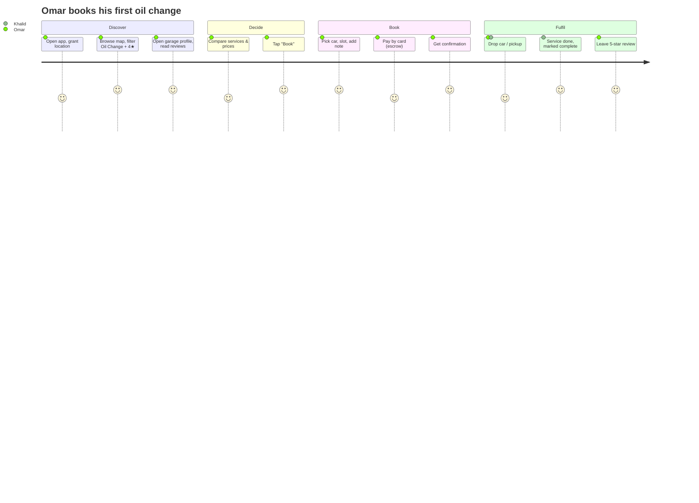

### 9.2 Driver — Accident Quotation (⭐ Flagship Journey)

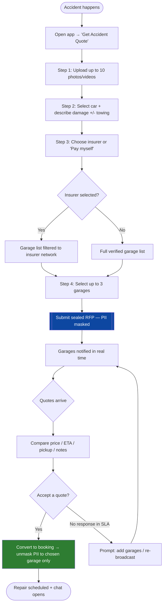

### 9.3 Garage — Win a Job via RFP

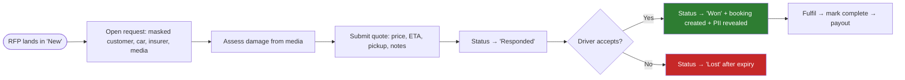

### 9.4 Garage — Onboarding to Live

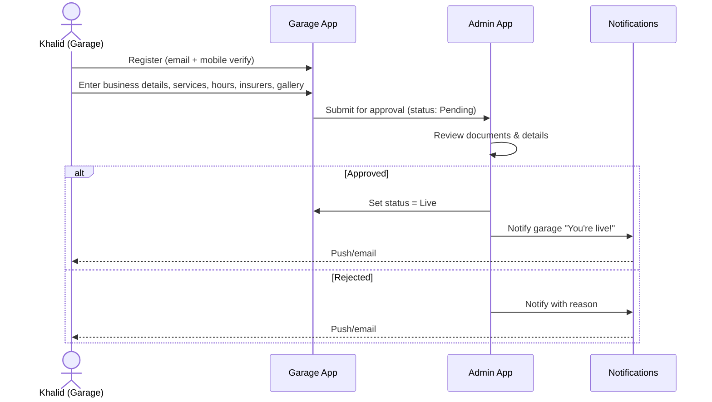

### 9.5 Spare-Parts Purchase

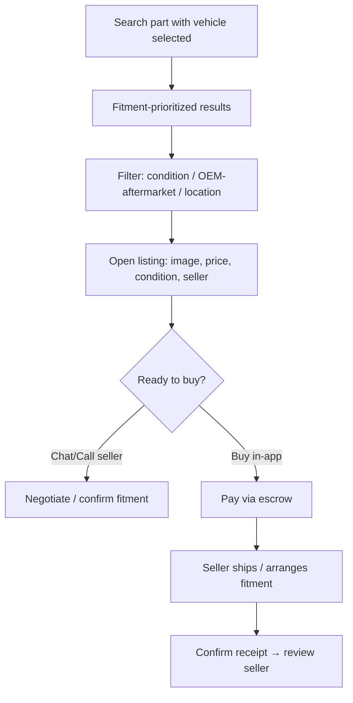

### 9.6 Supplier — List a Part & Fulfil an Order

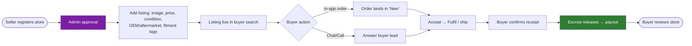

### 9.7 Insurer — Network to Claim Decision

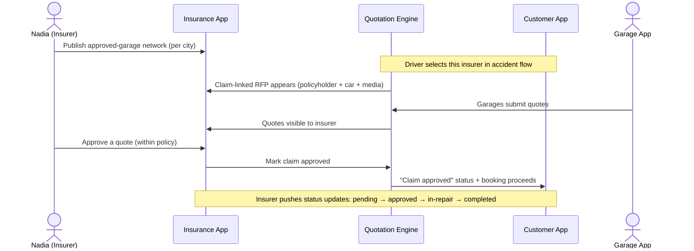

---

## 10. 🔀 Flow Diagrams & State Machines

### 10.1 Accident Quote — Lifecycle State Machine

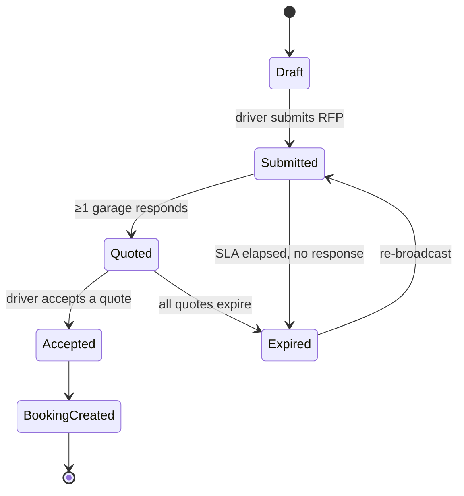

### 10.2 Booking — Lifecycle State Machine

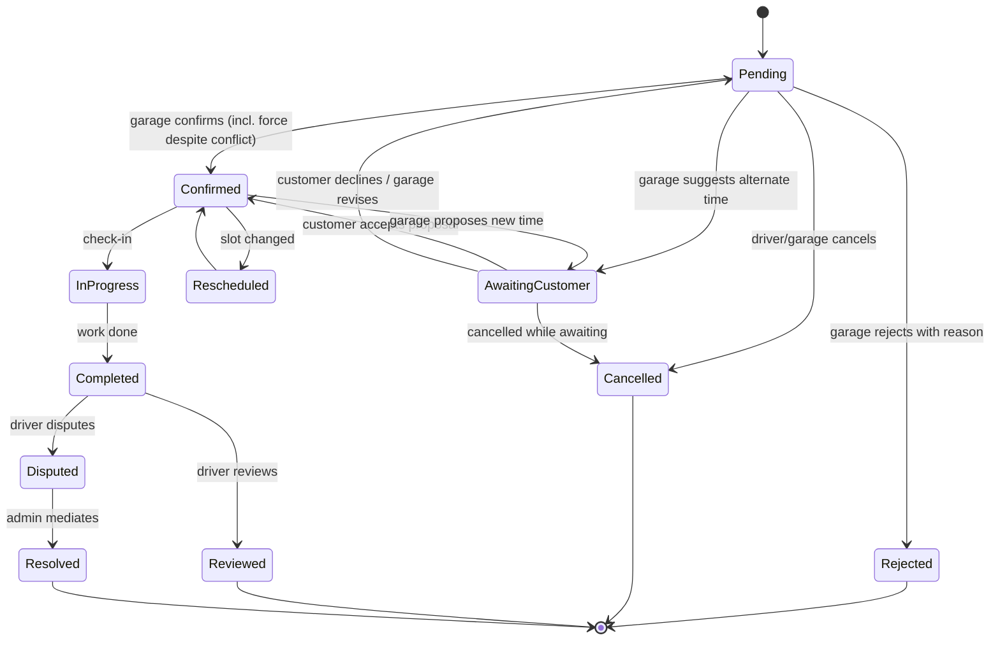

> **Conflict note:** Customers may request a busy/conflict-allowed slot; those land as Pending (or Conflict on the garage calendar) until the garage confirms, rejects, or suggests another time.

### 10.3 Payment / Escrow — Sequence

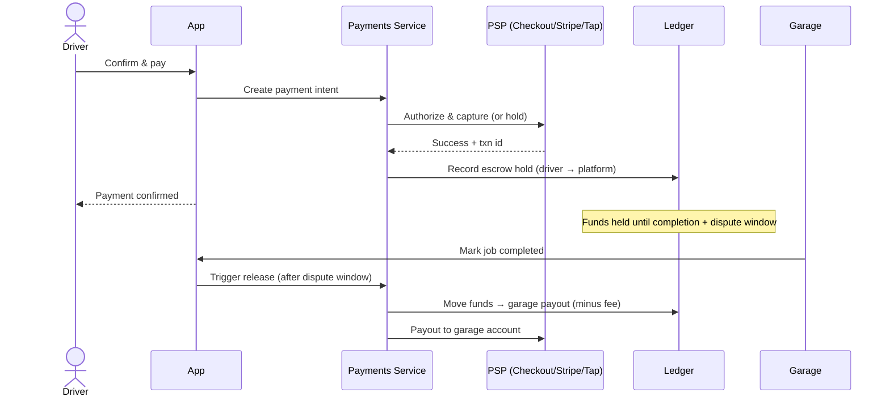

### 10.4 Real-Time Chat — Sequence

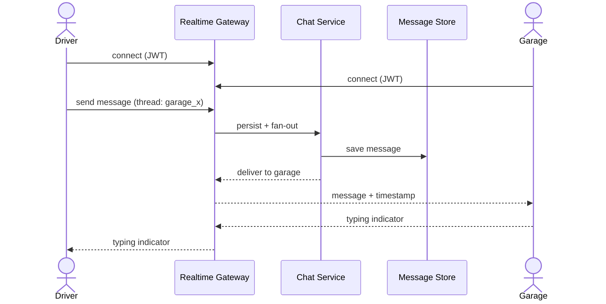

### 10.5 Garage Ranking (Discovery) — Decision Flow

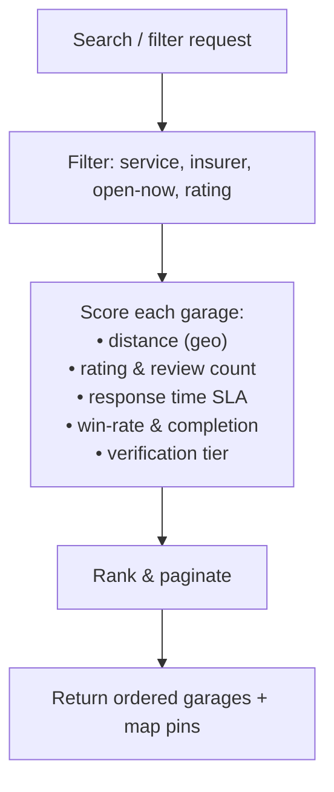

### 10.6 Parts Order — Lifecycle State Machine

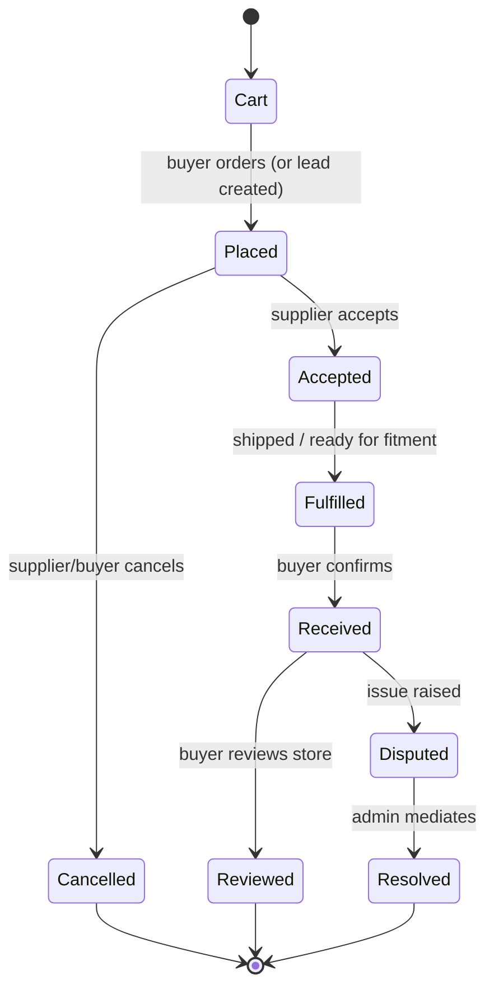

### 10.7 Insurance Claim / Network — State Machine

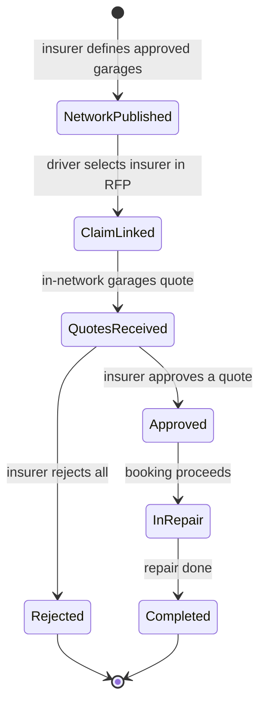

---

## 11. 🧭 Information Architecture & Screen Inventory

### App Sitemap (Customer)

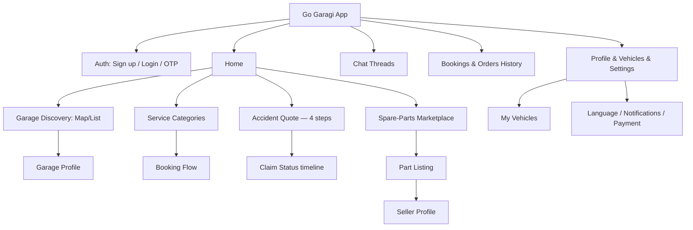

> The Customer app is the only mobile (React Native) app. The **Garage, Supplier, Insurance, and Admin apps are separate web apps**, each with its own sitemap centered on that role's board(s) → detail → action pattern.

### Screen Inventory (MVP) — grouped by app

**📱 Customer App**

| # | Screen | Key elements |
|---|---|---|
| C-S1 | Splash / Onboarding | Value props, language pick |
| C-S2 | Sign up / Login | Email/OTP/Google |
| C-S3 | Home | Categories, search, "Accident Quote" CTA, nearby garages |
| C-S4 | Discovery (Map) | Live location, color pins, filters |
| C-S5 | Discovery (List) | Garage cards + actions |
| C-S6 | Garage Profile | Gallery, services, reviews, insurance badges, Call/Chat/Book |
| C-S7–S10 | Accident Quote Steps 1–4 | Media, damage, insurance, garage select |
| C-S11 | Quote Waiting / Compare | Live quotes, compare, accept |
| C-S12 | Service Booking | Car, service, slot, notes, pay |
| C-S13 | Parts Search & Listing | Predictive search, filters, listing |
| C-S14 | Seller (Store) Profile | Gallery, contact, reviews |
| C-S15 | Chat | Bubbles, typing, image upload |
| C-S16 | Booking & Orders History | Tabs + actions |
| C-S17 | Claim Status | Insurer claim state timeline |
| C-S18 | Profile / Vehicles / Settings | Multi-vehicle, language, payment |

**🔧 Garage App (Web)**

| # | Screen | Key elements |
|---|---|---|
| G1 | Login | Demo credentials, start onboarding |
| G2 | Onboarding + Pending approval | Business details, services catalog, hours; wait / simulate approve |
| G3 | Dashboard | KPIs (bookings, pending, quotes, rating) + quick access |
| G4 | Booking Inbox | Tabs Pending / Awaiting customer / Confirmed / Rejected; review & confirm; reject flow |
| G5 | Quote Requests Board | New/Responded/Won/Lost; submit quote dialog |
| G6 | Calendar Availability | Week grid; Available / Booked / Blocked / Conflict; block / resolve / manage |
| G7 | Services & Pricing | List + add/edit service (duration, AED price) |
| G8 | Promotions Manager | Active promos, % / fixed discount, date range |
| G9 | Reviews | Filters, sort, respond dialog |
| G10 | Earnings & Payouts | Balances + searchable/filterable history |
| G11 | Reports | Period KPIs + status / trend / demand charts |
| G12 | Profile / Edit | Contact, hours, insurers, reset demo, language via toolbar |

> Visily inspiration assets: `Docs/Sample Screens/` (see that folder’s README for file → screen mapping).

**📦 Supplier App (Web)**

| # | Screen | Key elements |
|---|---|---|
| SUP1 | Login / Store Onboarding | Store details, gallery, approval status |
| SUP2 | Inventory / Listings | Add/edit/delete parts; image, price, condition, OEM/aftermarket, fitment |
| SUP3 | Orders / Leads Board | New/Accepted/Fulfilled/Cancelled |
| SUP4 | Buyer Chat | Threads per buyer |
| SUP5 | Reviews | View & respond |
| SUP6 | Earnings / Payouts | Balance, per-order breakdown |

**🛡️ Insurance App (Web)**

| # | Screen | Key elements |
|---|---|---|
| INS1 | Login / Insurer Onboarding | Brand, badge, cities, approval |
| INS2 | Network Manager | In-network garages per city |
| INS3 | Claim-linked Quotes | Policyholder RFPs + quotes |
| INS4 | Claim Decision | Approve/reject, push status |
| INS5 | Analytics | Claims routed, avg cost, top garages |

**⚙️ Admin App (Web)**

| # | Screen | Key elements |
|---|---|---|
| A1 | Accounts (Users/Garages/Suppliers/Insurers) | Approve/suspend, tags |
| A2 | Moderation Queue | Reviews, photos, part listings |
| A3 | Analytics | Charts + export (services, parts, claims) |
| A4 | Platform Settings | Insurers, categories, geos, module toggles |

---

## 12. 🖼️ Wireframe Annotations

> Textual wireframe specs for the highest-value screens (design team to translate into hi-fi). Layout described top→bottom.

<details>
<summary><b>S4 — Garage Discovery (Map)</b></summary>

- **Top bar:** search field (predictive) + filter icon (badge shows active filter count).
- **Filter sheet (bottom):** Service type chips, "Insurance-approved only" toggle, Rating slider (4★+), "Open now" toggle, Apply button.
- **Map:** user location dot; garage pins color-coded (green ≥4.5, amber 3.5–4.4, grey <3.5 / unrated); tap pin → mini card.
- **Mini card (overlay):** logo, name, rating, distance, 2–3 service tags, Call · Chat · Book.
- **Toggle:** floating "List/Map" switch, bottom-right. Persists filters.
</details>

<details>
<summary><b>S7–S11 — Accident Quote (4 steps + compare)</b></summary>

- **Progress header:** step 1–4 indicator.
- **Step 1 Media:** grid of thumbnails, "+" add tile, counter "x/10", accepted types hint, live preview on tap, delete on long-press.
- **Step 2 Damage:** car selector (saved cars + "Add new"), multiline description with live char counter (min 20), optional date/time picker, "Towing needed" toggle.
- **Step 3 Insurance:** insurer dropdown + "No insurance / pay myself" option; helper text explaining network filtering.
- **Step 4 Garages:** filtered list, each card = name, rating, Chat, Call, select checkbox (max 3, disabled after 3), sticky "Submit request".
- **S11 Compare:** cards per quote — garage, price (bold), ETA, pickup badge, notes, Chat; "Accept" primary button; empty state = animated waiting + "re-broadcast" after SLA.
</details>

<details>
<summary><b>S15 — Chat</b></summary>

- Header: garage name, avatar, online/after-hours status.
- Thread: right-aligned user bubbles, left-aligned garage bubbles, timestamps, image thumbnails, typing indicator.
- Composer: text field, attach (image), send. After-hours banner if applicable.
</details>

<details>
<summary><b>G5 — Garage Quote Requests Board</b></summary>

- Tabs: New · Responded · Won · Lost (counts).
- Row: masked customer initial, car (make/model/year), insurer badge, media count, "Respond" CTA, age/SLA countdown.
- Expand drawer: media gallery, damage text; quote form → Price, Time-to-complete, Pickup (Y/N), Notes; Submit.
</details>

<details>
<summary><b>G4 — Booking Inbox + Confirm / Suggest</b></summary>

- Tabs: Pending · Awaiting customer · Confirmed · Rejected.
- Card: date chip, customer, service, vehicle, time; conflict warning when slot overlaps.
- Primary: **Review & confirm** → dialog with Accept at requested time **or** Suggest another time.
- Suggest mode: interactive **calendar grid** of free slots (not a plain dropdown); selected cell → Send suggestion → status Awaiting customer.
- Reject route: reason/suggestion free text → Send Rejection.
</details>

<details>
<summary><b>G6 — Calendar Availability + Conflict Resolve</b></summary>

- Week columns × hour rows (business hours); chip per slot: Available / Booked / Blocked / Conflict.
- Tap Available → block (general or booking-linked). Tap Blocked → unblock. Tap Booked → suggest/move. Tap Conflict → resolve.
- Conflict dialog: Accept both (double-book) **or** move one booking via the same calendar suggest picker + notify/direct options.
</details>

<details>
<summary><b>Toolbar — Language + Notifications</b></summary>

- Language switcher: EN / AR / ES / FR / RU / DE; Arabic flips `dir=rtl` for layout.
- Notifications menu: unread badge; items for pending bookings, today's reminders, new quotes, unanswered reviews; mark read / mark all.
</details>

<details>
<summary><b>SUP2 — Supplier Inventory / Listings</b></summary>

- Top bar: "Add listing" primary button, search + filter (condition, type, availability).
- Table/grid rows: thumbnail, part name, price, condition badge (New/Used), type badge (OEM/Aftermarket), fitment chips (make/model/year), stock toggle, edit/delete.
- Add/edit drawer: image uploader (presigned), name, price, condition, type, fitment multi-select (make → model → year), description, availability. Save → validation → live in buyer search.
- Empty state: "List your first part" with CSV bulk-import shortcut.
</details>

<details>
<summary><b>SUP3 — Supplier Orders / Leads Board</b></summary>

- Tabs: New · Accepted · Fulfilled · Cancelled (counts).
- Row: buyer initial (masked), part, qty, amount, channel (order vs chat lead), age.
- Actions: Accept, Mark fulfilled, Chat with buyer; on fulfilment → escrow release scheduled.
</details>

<details>
<summary><b>INS2 — Insurer Network Manager</b></summary>

- City selector (tabs/dropdown) at top.
- Two-pane: left = searchable list of verified garages in city; right = "In my network" list.
- Add/remove garages (drag or toggle); each in-network garage displays the insurer badge to drivers.
- Bulk actions; audit note on changes.
</details>

<details>
<summary><b>INS3 / INS4 — Claim-linked Quotes & Decision</b></summary>

- List of policyholder RFPs: policyholder (masked ID/policy no.), vehicle, damage summary, media count, quotes received.
- Expand: per-garage quotes (price, ETA, pickup, notes); policy-limit indicator.
- Decision: Approve (select quote) / Reject (with reason) → pushes claim status to the Customer App.
</details>

---

## 13. ⚙️ Non-Functional Requirements (NFRs)

| Category | Requirement |
|---|---|
| **Performance** | P95 API latency < 400 ms; app cold start < 3 s; map render < 1.5 s |
| **Scalability** | Support 100k MAU and 5k garages without re-architecture; horizontal scale |
| **Availability** | 99.9% for core booking/quote APIs; graceful degradation of non-critical features |
| **Security** | OWASP ASVS L2; encryption in transit (TLS 1.2+) & at rest; JWT + refresh; RBAC |
| **Privacy** | PII masking in RFPs; data minimization; consent management; right to erasure |
| **Compliance** | UAE PDPL; localized data residency where required; PCI-DSS SAQ-A (tokenized payments) |
| **Localization** | Garage UI: EN/AR/ES/FR/RU/DE with Arabic RTL; platform templates EN/AR-first; locale-aware dates/currency |
| **Accessibility** | WCAG 2.1 AA (contrast, screen-reader labels, tap targets ≥ 44px) |
| **Observability** | Centralized logs, metrics, distributed tracing; alerting on SLOs |
| **Reliability** | Idempotent payment & quote submission; retry/queue for notifications |
| **Offline resilience** | Cache last-viewed garages/bookings; graceful no-network states |

---

## 14. 🛡️ Trust, Safety & Marketplace Quality

Trust is the #1 industry pain point — it is a **product surface**, not an afterthought.

| Mechanism | Description |
|---|---|
| **Garage verification tiers** | Basic (doc-verified) → Verified (inspected) → Premium (SLA-backed). Badge shown everywhere. |
| **Escrow-protected payments** | Funds held until job completion + dispute window. |
| **Before/after photo evidence** | Garages upload DVI-style photos; attached to booking record. |
| **Ratings integrity** | Only completed-job customers can review; anomaly detection on review velocity. |
| **Dispute mediation** | Structured flow: raise → evidence → admin decision → refund/release. |
| **PII masking** | Customer identity masked in RFPs until a quote is accepted. |
| **Fraud controls** | Device/velocity checks, duplicate-account detection, payout holds on new garages. |
| **Content moderation** | Human + automated review of photos and reviews before publish. |
| **Abuse reporting** | One-tap report on reviews, chats, listings → moderation queue. |

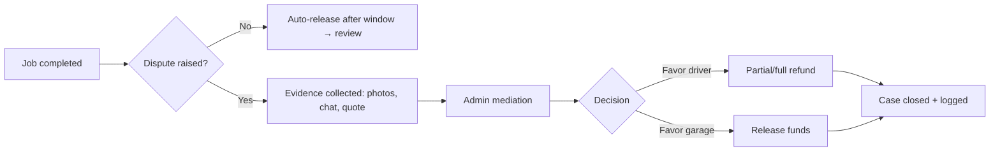

---

## 15. 💰 Monetization & Business Model

### Revenue Streams

| Stream | Model | When | Notes |
|---|---|---|---|
| **Service commission** | 8–12% take-rate on completed bookings | MVP | Blended by category |
| **Accident-quote lead / success fee** | Fixed lead fee or % on won repair | MVP | Higher value than routine |
| **Parts marketplace commission** | 5–10% per order | Phase 1 | Plus promoted listings |
| **Garage SaaS subscription** | Tiered monthly (calendar, analytics, priority leads) | Phase 2 | Supply lock-in ("Garage OS") |
| **Consumer "Plus" membership** | Monthly — discounts, priority, roadside | Phase 2 | Recurring, GarageBuddy-style |
| **Insurer B2B2C fees** | Per-claim routing / network SaaS | Phase 2–3 | High-margin infrastructure |
| **BNPL referral** | Rev-share with Tabby/Tamara | Phase 2 | Converts big-ticket repairs |
| **Recovery commission** | % per tow job | Phase 2 | Marketplace extension |
| **Featured placement / ads** | Garages & sellers boost visibility | Phase 3 | Non-intrusive, clearly labeled |

### Unit-Economics Framing (illustrative)

```mermaid
graph LR
    GMV[GMV per job] --> Take[× take-rate 8–12%]
    Take --> Rev[Net revenue]
    Rev --> Minus[− payment fees − support − CAC amortization]
    Minus --> CM[Contribution margin per job]
    CM --> LTV[× repeat frequency → LTV]
    LTV --> Ratio{LTV : CAC ≥ 3:1 target}
```

> **Flywheel:** more drivers → more RFPs/bookings → more garages join → faster/cheaper quotes → better prices & trust → more drivers. Parts and insurer layers deepen each turn.

---

## 16. 📐 Analytics & Instrumentation

### Event Taxonomy (excerpt)

| Event | Properties | Purpose |
|---|---|---|
| `signup_completed` | method, locale | Acquisition |
| `vehicle_added` | make, model, year | Activation |
| `discovery_filtered` | filters[] | Intent signal |
| `garage_profile_viewed` | garage_id, source | Funnel |
| `accident_quote_started` | has_insurance | Flagship funnel |
| `accident_quote_submitted` | media_count, garages_selected, insurer | Liquidity |
| `quote_received` | rfp_id, garage_id, price, eta | Supply performance |
| `quote_accepted` | rfp_id, garage_id, price | Conversion |
| `booking_created` | service_type, garage_id, amount | North Star |
| `booking_completed` | duration, rating | Quality |
| `payment_succeeded` | amount, method | Revenue |
| `chat_message_sent` | thread_id, has_media | Engagement |
| `review_submitted` | stars | Trust |
| `dispute_opened` | booking_id, reason | Safety |

Requirements: consistent user/garage IDs across web & mobile; funnel dashboards per persona; cohort retention; real-time liquidity board (fill-rate, time-to-first-quote) for Ops.

---

## 17. 🌍 Localization & Compliance

| Area | Requirement |
|---|---|
| **Languages (Garage UI)** | English, Arabic, Spanish, French, Russian, German — full UI chrome translated from Garage prototype v1.1 |
| **Languages (platform templates)** | English + Arabic for SMS / email / push at MVP; expand with markets |
| **RTL** | Arabic mirrored layouts (MUI Emotion + stylis RTL in garage web); icon direction, bidi text; locale-aware dates/currency |
| **Templates** | Localized SMS, email, push |
| **UAE data protection** | UAE PDPL: lawful basis, consent, data-subject rights, breach process |
| **Payments** | PCI-DSS via tokenized PSP; no raw card storage |
| **e-Invoicing (expansion)** | KSA ZATCA Phase 2, Egypt ETA — design invoice model to be country-configurable |
| **Consumer protection** | Transparent pricing, refund/dispute rights, T&Cs acceptance logged |
| **Insurance regulation** | Align insurer integrations with local regulator requirements |
| **Multi-country config** | Country = a first-class dimension (currency, tax, insurers, categories, geos) |

---

## 18. 🚦 Release Plan & Phasing

```mermaid
gantt
    title Go Garagi — Delivery Timeline (indicative)
    dateFormat YYYY-MM-DD
    axisFormat %b
    section Foundations
    Design system + infra + auth        :f1, 2026-08-01, 30d
    section MVP Core
    Discovery + Profiles + Vehicles     :m1, after f1, 30d
    Accident Quote Engine               :m2, after f1, 45d
    Service/Wash Booking + Calendar     :m3, after m1, 30d
    Chat + Notifications                :m4, after m1, 25d
    Garage App + Admin App              :m5, after m1, 40d
    Supplier App + Parts marketplace    :m5b, after m1, 40d
    Insurance App (network + quotes)    :m5c, after m2, 35d
    Payments + Escrow                   :m6, after m3, 30d
    section Beta
    Closed beta (1 city, seed supply)   :b1, after m6, 30d
    Public MVP launch (UAE)             :milestone, after b1, 0d
    section Phase 2
    Parts marketplace GA + Recovery     :p1, after b1, 45d
    Insurer claim decisioning + status  :p1b, after b1, 40d
    AI damage estimator + BNPL + Loyalty:p2, after p1, 60d
```

### Launch Strategy — "Liquidity First"
1. **Seed supply** in one city (Dubai): recruit 50–100 verified garages before consumer launch (avoid empty-marketplace problem).
2. **Concentrate demand**: geo-targeted acquisition in the same zone → high fill-rate.
3. **Prove the loop**: quote fill-rate, time-to-first-quote, completion, CSAT.
4. **Expand** city-by-city, then country-by-country using the same playbook.

---

## 19. 🏆 Future Roadmap — The Path to #1 Worldwide

Sequenced into **three horizons**. Everything from the original future list is included and expanded.

### Horizon 1 (0–12 mo) — Win UAE, Complete the Super-App
- 🚛 **Car Recovery / Towing marketplace** — live location, issue type, nearby tow list/map, ETA, real-time tracking, Recovery Partner dashboard (accept/reject, history, status).
- 💳 **Installment payments (BNPL)** — Tabby / Tamara integration; garage paid upfront, driver pays in installments.
- 🧾 **Online payments GA** — cards, Apple Pay, Mada/STC Pay, local gateways.
- 🌐 **Full Arabic RTL polish** + localized comms.

### Horizon 2 (12–24 mo) — Intelligence & Insurer Rails
- 🤖 **AI-Powered Damage Estimator** — scans uploaded photos, suggests cost range (driver-side), lifts quote conversion; feeds pricing intelligence.
- 🧠 **AI diagnosis & smart intake** — describe symptoms / VIN & plate scan → likely issue + fair-price band + matched garages.
- 🔗 **Insurance API integration** — garages submit quotes into insurer systems; insurers approve/reject; drivers see live claim status.
- 🎁 **Loyalty & referral** — points for bookings, reviews, referrals → redeemable discounts.
- 🏪 **Garage OS (paid tier)** — inventory, DVI reports, staff roles, payouts, analytics — the supply moat.

### Horizon 3 (24–48 mo) — Global Platform & New Verticals
- 🌍 **Multi-country expansion** — KSA, Egypt, wider GCC, then international, using country-config engine.
- 🛰️ **Telematics & predictive maintenance** — connected-car / OBD alerts → proactive service.
- 🥽 **AR-guided damage capture & install guidance** (aftermarket trend).
- 🚗 **Fleet & B2B** — SMB fleet management dashboards.
- 🏦 **Embedded insurance & warranty** — sell/renew policies, extended warranties in-app.
- 📊 **Repair-price intelligence API** — monetize the industry's most complete MENA repair-cost dataset.

```mermaid
timeline
    title Path to #1
    Horizon 1 : Super-app complete (service, wash, parts, recovery, pay) : UAE leadership
    Horizon 2 : AI estimator + insurer rails + Garage OS : Defensible moats live
    Horizon 3 : Multi-country + telematics + embedded insurance : Global category leader
```

> **Why this wins globally:** the combination of *demand aggregation* (super-app), *supply lock-in* (Garage OS), *insurer infrastructure*, and a *proprietary repair-price + damage dataset* compounds. Frontier competitors can copy a feature; they cannot easily copy the **network + data + trust** flywheel across markets.

---

## 20. ⚠️ Risks & Mitigations

| # | Risk | Likelihood | Impact | Mitigation |
|---|---|:--:|:--:|---|
| R1 | Empty-marketplace (no garages → no drivers) | High | High | Seed supply first; single-city launch; concierge onboarding |
| R2 | Garages transact off-platform (leakage) | High | High | Escrow value, dispute protection, lead-only masking, loyalty for on-platform |
| R3 | Low garage digital literacy | Med | Med | WhatsApp-simple UX, Arabic, onboarding support, minimal-click quote |
| R4 | Trust failures / bad repairs | Med | High | Verification tiers, escrow, before/after evidence, reviews, mediation |
| R5 | Insurer integration complexity | Med | Med | Start "lite" (network publish), API later; partner design-partners |
| R6 | Payment/compliance friction | Med | High | Tokenized PSP, PCI SAQ-A, phased rollout, legal review |
| R7 | Fraud (fake accounts/reviews/claims) | Med | Med | Device/velocity checks, payout holds, anomaly detection |
| R8 | CAC too high vs LTV | Med | High | Geo-concentrated growth, referrals, retention via super-app breadth |
| R9 | Regulatory changes (data/insurance) | Low | High | Country-config, data residency, ongoing legal monitoring |

---

## 21. ❓ Open Questions & Assumptions

**Open questions**
1. Launch city/emirate and initial insurer design-partners?
2. Escrow provider & payout rails for garages (settlement timing)?
3. Chat: build vs. managed (Stream/Twilio) — decided in RFC.
4. Parts logistics: seller-fulfilled vs. platform-assisted fitment at launch?
5. KYC depth required for garages/sellers by regulator?

**Assumptions**
- Card + Apple Pay acceptable at launch; BNPL follows.
- Garages have smartphones/PCs for the web dashboard.
- Single launch country (UAE) with country-config built for expansion.
- Recovery, AI estimator, BNPL, loyalty are post-MVP.

---

## 22. 📎 Appendix

### Glossary
| Term | Meaning |
|---|---|
| **RFP** | Request-for-Price: the sealed accident-quote request sent to up to 3 garages |
| **DVI** | Digital Vehicle Inspection (photo-backed report) |
| **Escrow** | Held funds released on completion/dispute-window elapse |
| **Fill-rate** | % of RFPs receiving ≥1 quote |
| **Garage OS** | Supply-side SaaS toolset (calendar, leads, payouts, analytics) |
| **Take-rate** | Platform commission as % of GMV |
| **PII masking** | Hiding customer identity until quote acceptance |
| **AwaitingCustomer** | Booking status after garage suggests an alternate `proposedAt` time |
| **Conflict slot** | Calendar cell with overlapping active bookings (or customer-chosen busy slot) |

### Garage Web Prototype (shipped in this repo)

| Item | Detail |
|---|---|
| **Repo** | `go-garagi-garages` (this codebase) |
| **Web mount** | `/gogaragi-garage/` |
| **Garage API** | `/gogaragi-garage/api/` (garage-only BFF module; modular-monolith slice) |
| **Stack** | React 19 · Vite · TypeScript · MUI 7 (MD3) · Zustand · i18next · React Router 7 · Express garage module |
| **Demo login** | `khalid@alquozgarage.ae` / `demo1234` |
| **Seed** | Al Quoz Auto Care (UAE) — bookings, quotes, services, promotions, reviews, payouts, calendar |
| **Reset** | Profile → Reset Demo Data |
| **Persist** | Zustand key `go-garagi-garage-v6`; language `go-garagi-lang` |
| **RN-ready** | Pure domain under `src/domain/` (types, booking/quote machines, availability, notifications, format) |
| **Not yet** | Full Nest modulith, chat, real escrow/PSP, staff RBAC, push/SMS, month calendar |

### References (market grounding)
- IMARC Group — *Automotive Repair & Service Market* (2025 value ~$744B → ~$1.06T by 2034; APAC leading share).
- Verified Market Reports — *Automobile Repair Software Market* (~$1.8B 2026 → ~$2.64B 2032).
- Competitive scan: ServiceMyCar, MySyara (incl. MySyara OS), GarageBuddy, Openbay/RepairPal, YourMechanic/Wrench, Fixico.

### Traceability
Every `US-###` maps to an epic `GG-E#` and is realized by a component/service in **`Go_Garagi_RFC.md`** (see RFC §Component Breakdown & §API Design).

<div align="center">

---

**End of PRD — Go Garagi v1.1**
*Companion technical design: `Go_Garagi_RFC.md`*

</div>
