<div align="center">

# 🏗️ Go Garagi — RFC / Technical Design Document

### System Architecture · Data Model · APIs · Infrastructure


</div>

---

## 📄 Document Control

| Field | Value |
|---|---|
| **Title** | Go Garagi — Technical Design (RFC) |
| **Type** | Request for Comments / Architecture Design |
| **Version** | 1.1 |
| **Status** | 🟡 Proposed → seeking review sign-off |
| **Author** | Engineering / Architecture |
| **Reviewers** | Eng Lead · Platform · Security · SRE · Product |
| **Companion** | `Go_Garagi_PRD.md` (product requirements) |
| **Garage prototype repo** | `go-garagi-garages` — Garage OS web at `/gogaragi-garage/` + garage API at `/gogaragi-garage/api/` |
| **Mandated stack** | TypeScript + Node.js (backend) · React (web) → React Native (mobile) · AWS |

### Change Log
| Ver | Date | Change |
|---|---|---|
| 1.0 | — | Initial full technical design: architecture, domains, data model, APIs, infra, security, observability, DevOps, milestones |
| **1.1** | 2026-08-01 | Garage prototype stack (MUI MD3, Zustand persist, 6-locale i18n); booking conflict / suggest-time model; in-app notification inbox; ADR-11 |

---

## 🧭 Table of Contents
1. [Summary](#1--summary)
2. [Goals & Non-Goals](#2--goals--non-goals)
3. [Constraints & Principles](#3--constraints--principles)
4. [Architecture Overview](#4--architecture-overview)
5. [C4 — System Context](#5--c4-level-1--system-context)
6. [C4 — Container View](#6--c4-level-2--containers)
7. [Domain / Component Breakdown](#7--domain--component-breakdown)
8. [Technology Stack (Detailed)](#8--technology-stack-detailed)
9. [Repository Strategy & Code-Sharing (Separate Apps)](#9--repository-strategy--code-sharing-separate-apps--multi-repo)
10. [Data Model](#10--data-model)
11. [API Design](#11--api-design)
12. [Key Flows (Sequences)](#12--key-flows-sequence-designs)
13. [Search & Geo-Discovery](#13--search--geo-discovery)
14. [Realtime & Chat](#14--realtime--chat-architecture)
15. [Media Pipeline](#15--media-pipeline)
16. [Payments, Escrow & Ledger](#16--payments-escrow--ledger)
17. [Notifications](#17--notifications)
18. [AuthN / AuthZ](#18--authentication--authorization)
19. [Security & Threat Model](#19--security--threat-model)
20. [Observability](#20--observability)
21. [Scalability & Performance](#21--scalability--performance)
22. [AWS Infrastructure & DevOps](#22--aws-infrastructure--devops)
23. [Data & Analytics Platform](#23--data--analytics-platform)
24. [Multi-Region & Data Residency](#24--multi-region--data-residency)
25. [Testing Strategy](#25--testing-strategy)
26. [Cost Envelope](#26--cost-envelope-indicative)
27. [Alternatives & Trade-offs (ADRs)](#27--alternatives--trade-offs-adrs)
28. [Engineering Milestones](#28--engineering-milestones)
29. [Open Questions](#29--open-questions)
30. [Appendix](#30--appendix)

---

## 1. 📌 Summary

This RFC specifies the technical design for **Go Garagi**, the automotive super-app defined in the PRD. It covers a **modular-monolith backend** (NestJS/TypeScript) that decomposes cleanly into services as scale demands, **five separate client applications** — **Customer** (React Native), **Garage** (React web), **Supplier** (React web), **Insurance** (React web), and **Admin** (React web) — each in **its own repository** with its own release cadence, sharing a common design system and domain logic through **published, versioned packages**, and an **AWS** reference architecture.

**Design thesis:** *Optimize for delivery speed and correctness at MVP with a well-bounded "modulith," while pre-drawing service seams (Identity, Quotation, Booking, Marketplace, Payments, Chat) so extraction to microservices is mechanical, not a rewrite.*

The two highest-complexity subsystems — the **Accident Quotation Engine** (sealed, real-time, PII-masked multi-garage RFP) and the **Payments/Escrow ledger** — get dedicated attention because they carry the product's differentiation and its money.

---

## 2. 🎯 Goals & Non-Goals

### Goals
- Deliver all PRD **Must** epics on the mandated stack with production-grade security, observability, and CI/CD.
- **Web-first React** codebase that maximizes reuse into **React Native** (target ≥ 70% shared non-UI logic).
- **Real-time** quote and chat delivery with clear SLAs.
- **Escrow-grade** payment correctness (idempotent, auditable, double-entry ledger).
- **Country-configurable** foundation (currency, tax, insurers, geos) for later expansion.
- Horizontal scalability to 100k MAU / 5k garages without re-platforming.

### Non-Goals (this version)
- Full insurer claim-system API automation (Phase 2–3; design seams only).
- AI damage estimation model training/serving (Phase 2; capture data now).
- Native-only (Swift/Kotlin) apps — we go React Native for shared velocity.
- Multi-region active-active (single primary region at MVP; DR plan defined).

---

## 3. 🧰 Constraints & Principles

**Mandated:** TypeScript + Node.js · React → React Native · AWS.

**Engineering principles**
1. **Modulith-first, services-ready** — bounded contexts with explicit interfaces; no cross-module DB reads.
2. **Contract-first APIs** — OpenAPI + shared TypeScript types generated from a single source.
3. **Event-driven where it earns its keep** — domain events for quote/booking/payment side-effects (notifications, analytics) via a broker.
4. **Idempotency everywhere money or external calls happen.**
5. **Secure & private by default** — least privilege, PII minimization, masking as a first-class rule.
6. **Everything as code** — IaC, CI/CD, feature flags, migrations.
7. **Observable by default** — trace every request end-to-end.

---

## 4. 🏛️ Architecture Overview

Go Garagi runs as a **modular monolith** ("modulith") behind an API gateway, backed by PostgreSQL (with PostGIS), Redis, OpenSearch, and S3, with an event bus (EventBridge/SNS/SQS) for asynchronous side-effects and a WebSocket tier for realtime.

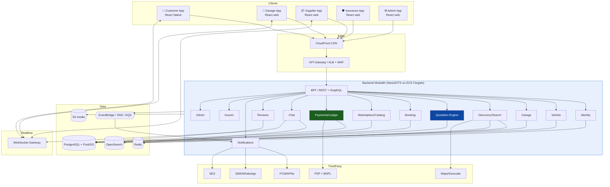

---

## 5. 🌐 C4 Level 1 — System Context

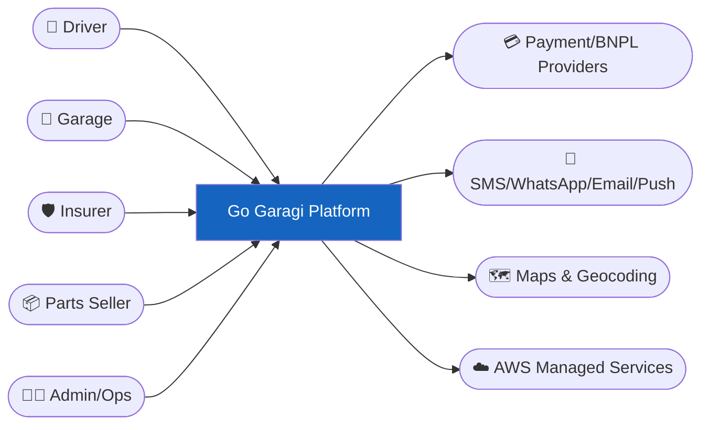

---

## 6. 📦 C4 Level 2 — Containers

> Each of the **five client apps** is an **independent deployable from its own repository** (see §9).

| Container | Repo | Tech | Responsibility |
|---|---|---|---|
| **Customer App** | `go-garagi-customer` | React Native (Expo) | Driver mobile experience (iOS/Android) |
| **Garage App** | `go-garagi-garage` | React + Vite | Garage web dashboard |
| **Supplier App** | `go-garagi-supplier` | React + Vite | Parts-seller web dashboard |
| **Insurance App** | `go-garagi-insurance` | React + Vite | Insurer web dashboard |
| **Admin App** | `go-garagi-admin` | React + Vite | Ops/admin web panel |
| **API/BFF** | `go-garagi-backend` | NestJS (Node 20, TS) | REST + GraphQL, auth, orchestration |
| **WebSocket Gateway** | `go-garagi-backend` | NestJS WS / API GW WebSockets | Realtime quotes, chat, presence |
| **Worker** | `go-garagi-backend` | NestJS + BullMQ | Async jobs: notifications, media processing, payouts |
| **PostgreSQL** | — | RDS Postgres + PostGIS | System of record |
| **Redis** | — | ElastiCache | Cache, sessions, rate-limit, pub/sub, queues |
| **OpenSearch** | — | AWS OpenSearch | Garage & parts search, geo + ranking |
| **S3 + CloudFront** | — | AWS | Media storage + CDN |
| **Event Bus** | — | EventBridge + SNS + SQS | Domain events, fan-out |

---

## 7. 🧩 Domain / Component Breakdown

Bounded contexts (each = a NestJS module with its own service interface, DTOs, and DB schema namespace):

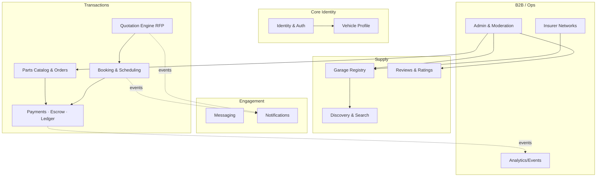

| Context | Key responsibilities | Owns entities |
|---|---|---|
| **Identity & Auth** | Signup/login (email/OTP/Google), JWT, RBAC, consent | User, Session, Role, Consent |
| **Vehicle** | Multi-vehicle CRUD, make/model/year catalog, VIN | Vehicle, VehicleMakeModel |
| **Garage Registry** | Onboarding, profile, services, hours, gallery, verification, approval | Garage, Service, OperatingHours, Media, VerificationTier |
| **Discovery & Search** | Geo search, filters, ranking, map pins | (read model / index) |
| **Quotation Engine** | RFP lifecycle, PII masking, quote submission, expiry, re-broadcast | QuoteRequest, QuoteResponse, RfpGarage |
| **Booking** | Slots, calendar, statuses, reschedule, conflict detection, suggest-time (`awaiting_customer`) | Booking, CalendarSlot, CustomerNotice, BookingNote |
| **Marketplace / Supplier** | Seller onboarding & store profile, parts catalog & fitment, listings, orders/leads, seller reviews & payouts | Seller, Store, Part, Listing, Fitment, PartOrder |
| **Payments/Ledger** | Intents, escrow, payouts (garage **and** supplier), double-entry ledger, refunds | PaymentIntent, LedgerEntry, Payout, Refund, Dispute |
| **Messaging** | Threads, messages, presence, after-hours (customer↔garage **and** customer↔supplier) | Thread, Message |
| **Reviews** | Ratings, responses, abuse reports (garages **and** stores) | Review, ReviewResponse, Report |
| **Notifications** | Multi-channel, templates, preferences | NotificationLog, Template, Preference |
| **Insurer** | Insurer onboarding, approved-garage networks, claim-linked quote visibility, claim decisioning & status | Insurer, NetworkMembership, Claim, ClaimDecision |
| **Admin & Moderation** | Approvals, suspensions, moderation queue, settings | ModerationItem, PlatformSetting, AuditLog |

---

## 8. 🛠️ Technology Stack (Detailed)

### Backend
| Concern | Choice | Rationale |
|---|---|---|
| Runtime | **Node.js 20 LTS** | Mandated; mature, async I/O fits marketplace |
| Language | **TypeScript (strict)** | Type-safety across full stack |
| Framework | **NestJS** | Modular, DI, opinionated → clean bounded contexts; easy service extraction |
| HTTP | Fastify adapter | Performance |
| ORM | **Prisma** (primary) + raw SQL / PostGIS where needed | Type-safe schema & migrations |
| Validation | Zod / class-validator | DTO validation, shared schemas |
| Queue/Jobs | **BullMQ** on Redis | Async payouts, media, notifications |
| Cache | Redis (ElastiCache) | Sessions, hot reads, rate-limit, pub/sub |
| Search | **OpenSearch** | Geo + full-text + ranking |
| Auth | JWT (access+refresh), OAuth2/OIDC, OTP | Multi-method login |
| Realtime | WebSocket (NestJS gateway) / API GW WebSockets | Chat + live quotes |

### Frontend
| Concern | Choice | Rationale |
|---|---|---|
| Web (target platform) | **React + Vite + TypeScript** | Fast DX; base for RN reuse |
| Web (Garage prototype — as-built) | **React 19 + Vite + MUI 7 (MD3)** + Emotion + stylis-plugin-rtl | Shipped Garage OS demo; see ADR-11 for design-system convergence |
| Mobile | **React Native (Expo)** | Convert web logic; OTA updates |
| Styling (platform packages) | Tailwind / NativeWind tokens in `@gogaragi/ui-*` | Long-term shared design system |
| State (server) | **TanStack Query** (when API lands) | Caching, retries, sync |
| State (client) | Zustand (+ persist for garage demo: `go-garagi-garage-v6`) | Lightweight; seed until BFF exists |
| Forms | React Hook Form + Zod | Shared validation with backend |
| Maps | react-native-maps / MapLibre + AWS Location | Discovery |
| i18n | i18next + RTL | Garage prototype: **EN / AR / ES / FR / RU / DE**; platform packages start EN/AR |
| Design system | Shared component lib as a **published package** (`@gogaragi/ui-*`) | Consistency across client repos; garage currently uses local `src/theme/` + MUI |
| Domain share | Local `src/domain/` → extract to `@gogaragi/domain` | Pure types, booking/quote machines, availability, formatters |

### Infrastructure (AWS)
| Concern | Service |
|---|---|
| Compute | **ECS Fargate** (API, WS, workers) — EKS optional at scale |
| DB | **RDS PostgreSQL (Multi-AZ) + PostGIS** |
| Cache/Queue | **ElastiCache (Redis)** |
| Search | **Amazon OpenSearch** |
| Object store | **S3** + **CloudFront** |
| Events | **EventBridge**, **SNS**, **SQS** |
| Auth (option) | **Cognito** (or self-managed JWT) |
| Notifications | **Pinpoint / SNS** (push), **SES** (email); Twilio/Unifonic (SMS/WhatsApp) |
| Media AI | **Rekognition** (content moderation), **MediaConvert** (video) |
| Maps | **Amazon Location Service** (+ Google fallback) |
| Secrets | **Secrets Manager** / SSM Parameter Store |
| Edge security | **WAF + Shield** |
| IaC | **Terraform** (or AWS CDK) |
| CI/CD | **GitHub Actions** → ECR → ECS (blue/green via CodeDeploy) |
| Analytics pipeline | **Kinesis Firehose → S3 → Athena/Redshift** |

---

## 9. 🧬 Repository Strategy & Code-Sharing (Separate Apps → Multi-Repo)

> [!IMPORTANT]
> **Decision:** Go Garagi is built as **separate, independently-versioned applications, each in its own Git repository** — the five client apps are *not* combined into one monorepo. Each app team owns its repo, release cadence, CI/CD pipeline, and deployment. Shared code is consumed as **published, versioned packages from a private registry**, not via workspace imports. *(See ADR-10.)*

### The Five App Repositories (+ backend + shared + infra)

```mermaid
graph TB
    subgraph clientRepos["5 Client Apps · 5 Separate Repos"]
      R1["📱 go-garagi-customer<br/>React Native (Expo)<br/>iOS + Android"]
      R2["🔧 go-garagi-garage<br/>React (Vite) web"]
      R7["📦 go-garagi-supplier<br/>React (Vite) web"]
      R8["🛡️ go-garagi-insurance<br/>React (Vite) web"]
      R3["⚙️ go-garagi-admin<br/>React (Vite) web"]
    end
    subgraph Backend Repo
      R4["🖥️ go-garagi-backend<br/>NestJS API · workers · ws-gateway"]
    end
    subgraph sharedRepo["Shared Libraries Repo"]
      R5["📦 go-garagi-shared<br/>@gogaragi/* published packages"]
    end
    subgraph Infra Repo
      R6["☁️ go-garagi-infra<br/>Terraform / CDK"]
    end
    REG[["🗄️ Private Package Registry<br/>AWS CodeArtifact / GitHub Packages"]]
    R5 -->|publishes @gogaragi/types, /domain, /api-client, /ui-*| REG
    R4 -->|publishes @gogaragi/types (from OpenAPI)| REG
    REG -->|npm install versioned deps| R1 & R2 & R7 & R8 & R3
    R4 -.serves API.-> R1 & R2 & R7 & R8 & R3
    style R1 fill:#e3f2fd,stroke:#1565c0
    style R2 fill:#e8f5e9,stroke:#2e7d32
    style R7 fill:#fff3e0,stroke:#e65100
    style R8 fill:#ede7f6,stroke:#4527a0
    style R3 fill:#fce4ec,stroke:#c2185b
    style REG fill:#0d47a1,color:#fff
```

| Repository | Contains | Stack | Deploys to |
|---|---|---|---|
| **`go-garagi-customer`** | Customer mobile app | React Native (Expo) | App Store / Play Store (EAS) |
| **`go-garagi-garage`** | Garage dashboard | React + Vite | CloudFront + S3 (web) |
| **`go-garagi-supplier`** | Parts-seller dashboard | React + Vite | CloudFront + S3 (web) |
| **`go-garagi-insurance`** | Insurer dashboard | React + Vite | CloudFront + S3 (web) |
| **`go-garagi-admin`** | Admin panel | React + Vite | CloudFront + S3 (web) |
| **`go-garagi-backend`** | API modulith, workers, WS gateway | NestJS / Node / TS | ECS Fargate |
| **`go-garagi-shared`** | Shared packages (published) | TypeScript | Private registry |
| **`go-garagi-infra`** | IaC | Terraform / CDK | AWS |

> The four web dashboards (garage, supplier, insurance, admin) share the same React + Vite foundation and shared packages, but are **separate repos with separate access control and release cadence** — a supplier release never couples to an insurer or admin release.

### Per-App Repo Layout (each client repo is self-contained)

```
go-garagi-customer/            # (garage, supplier, insurance & admin mirror this shape)
├─ src/
│  ├─ features/                # screen/feature modules
│  ├─ navigation/
│  ├─ components/              # app-specific UI
│  └─ app.tsx
├─ package.json                # deps include @gogaragi/* from private registry
├─ .npmrc                      # points scope @gogaragi → CodeArtifact
├─ eas.json / vite.config.ts   # build config
├─ .github/workflows/          # this app's OWN CI/CD
└─ Dockerfile (web apps)
```

### Shared Packages (the `go-garagi-shared` repo → published to the registry)

| Package | Purpose | Consumed by |
|---|---|---|
| `@gogaragi/types` | TS types generated from backend OpenAPI | all 5 apps |
| `@gogaragi/domain` | Pure business logic: quote/booking/order **state machines**, pricing math, Zod validation | all 5 apps (+ backend) |
| `@gogaragi/api-client` | Typed SDK + TanStack Query hooks | all 5 apps |
| `@gogaragi/ui-core` | Headless behavior + **design tokens** | all 5 apps |
| `@gogaragi/ui-web` | Web components (Tailwind) | garage, supplier, insurance, admin |
| `@gogaragi/ui-native` | RN components (NativeWind) | customer |
| `@gogaragi/i18n` | Locale bundles (EN/AR MVP platform; garage already EN/AR/ES/FR/RU/DE) | all 5 apps |
| `@gogaragi/config` | Shared eslint / tsconfig / tailwind presets | all repos |

### How Code Is Shared Across Separate Repos

Because the apps live in **different repositories**, they cannot import each other's source directly. Sharing is done through the registry with **semantic versioning**:

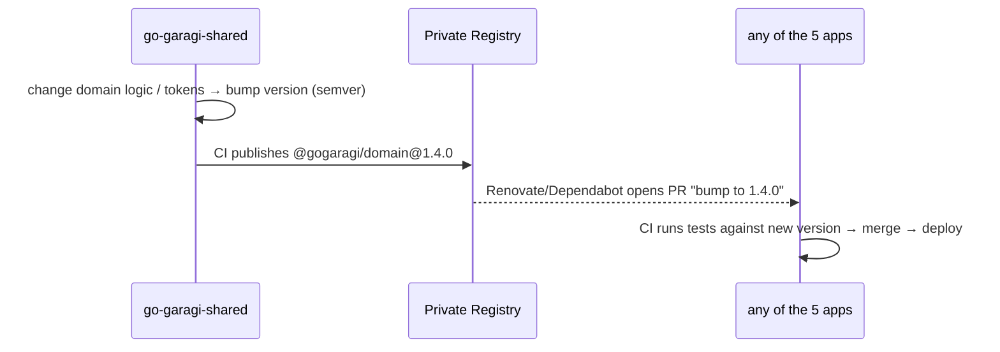

**Rules & guardrails**
- **Single source of truth for rules** stays intact: quote/booking state machines, pricing, and validation live *only* in `@gogaragi/domain`; the backend depends on the **same published package**, so front-of-house and back-of-house never diverge.
- **API contract:** backend emits **OpenAPI** on every release → `@gogaragi/types` + `@gogaragi/api-client` are code-generated and published → apps upgrade via automated dependency PRs. No drift.
- **Versioning:** strict **semver**; breaking changes = major bump; apps pin ranges and upgrade deliberately. A **changesets**-based release flow automates version + changelog.
- **UI:** platform-specific components (`ui-web` vs `ui-native`) but a shared **headless + tokens** layer (`ui-core`) keeps design language identical across all five apps. Target: **≥70% non-UI logic reuse** via shared packages.
- **Auth to registry:** each repo's `.npmrc` scopes `@gogaragi/*` to **AWS CodeArtifact** (or GitHub Packages); CI authenticates with short-lived tokens.

### Independent CI/CD per Repo

Each of the **five apps** (and the backend) has its **own** pipeline, release cadence, and rollback — a deploy of the supplier or insurance dashboard never blocks or couples to the customer app.

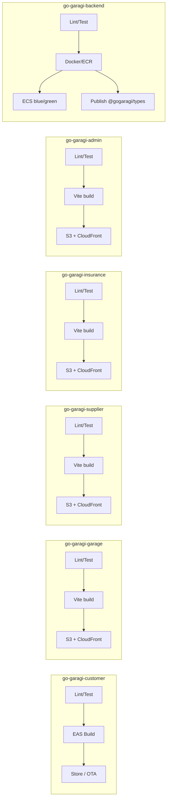

**Trade-off acknowledged:** multi-repo adds coordination overhead for cross-cutting changes (a shared-package change requires publish → dependency PRs across apps) versus a monorepo's atomic commit. We accept this in exchange for **clean team ownership, independent release cadence, smaller blast radius, and simpler per-app access control** — and we mitigate the overhead with automated versioning (changesets) and automated dependency updates (Renovate/Dependabot). *(Full rationale in ADR-10.)*

---

## 10. 🗄️ Data Model

### Core Entity-Relationship (excerpt)

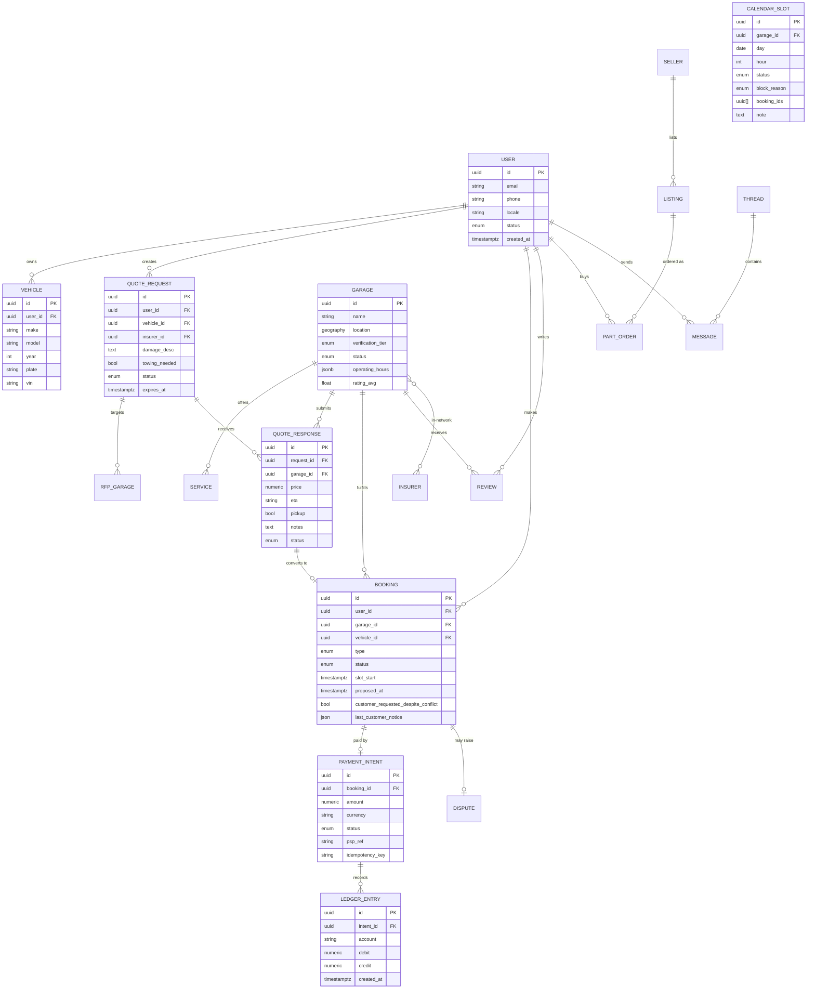

**Modeling notes**
- **Geo:** `GARAGE.location` as PostGIS `geography(Point,4326)` with GiST index for radius queries; mirrored to OpenSearch for ranked search.
- **PII masking:** RFP read models expose masked customer fields; unmasking is an authorization-gated projection triggered on quote acceptance.
- **Money:** `numeric`, never float; **double-entry** `LEDGER_ENTRY` (debits = credits) is the source of truth; PSP is external mirror.
- **Multi-country:** `country_code`, `currency`, `tax_profile` on transactional entities; insurers/categories/geos are config tables.
- **Soft deletes + audit:** `AUDIT_LOG` append-only for admin/moderation/payment actions.
- **State enums** enforced by application-level state machines (from `packages/domain`).

---

## 11. 🔌 API Design

**Style:** REST (versioned `/api/v1`) for CRUD + a thin **GraphQL BFF** for aggregate mobile screens (reduce round-trips). **WebSocket** for realtime. **Contract-first** via OpenAPI → generated client in `packages/types`.

### Conventions
- **Auth:** `Authorization: Bearer <access_jwt>`; refresh-token rotation.
- **Idempotency:** `Idempotency-Key` header required on POST that create money/quotes/bookings.
- **Pagination:** cursor-based (`?cursor=&limit=`).
- **Errors:** RFC-7807 problem+json: `{ type, title, status, detail, traceId }`.
- **Versioning:** URI version + deprecation headers.

### Representative Endpoints

| Method | Path | Purpose |
|---|---|---|
| `POST` | `/api/v1/auth/otp/request` | Request OTP |
| `POST` | `/api/v1/auth/otp/verify` | Verify → tokens |
| `POST` | `/api/v1/auth/oauth/google` | Google OAuth exchange |
| `GET` | `/api/v1/me` / `PATCH /me` | Profile |
| `GET/POST/DELETE` | `/api/v1/vehicles` | Vehicle CRUD |
| `GET` | `/api/v1/garages?lat&lng&service&insurer&openNow&minRating` | Discovery |
| `GET` | `/api/v1/garages/{id}` | Garage profile |
| `POST` | `/api/v1/quote-requests` | Create RFP (Idempotency-Key) |
| `GET` | `/api/v1/quote-requests/{id}` | RFP + responses (masked view) |
| `POST` | `/api/v1/quote-requests/{id}/accept` | Accept a quote → booking |
| `POST` | `/api/v1/garages/{id}/quotes` | Garage submits quote |
| `GET/POST` | `/api/v1/bookings` | Bookings |
| `PATCH` | `/api/v1/bookings/{id}` | Reschedule/cancel/complete |
| `GET` | `/api/v1/parts?q&brand&condition&type&loc` | Parts search |
| `POST` | `/api/v1/orders` | Parts order |
| `POST` | `/api/v1/payments/intents` | Create payment intent (escrow) |
| `POST` | `/api/v1/payments/webhook` | PSP webhook (signed) |
| `GET/POST` | `/api/v1/threads/{id}/messages` | Chat history/send |
| `POST` | `/api/v1/reviews` | Submit review |
| `POST` | `/api/v1/media/presign` | Get S3 presigned upload URL |
| `POST` | `/api/v1/admin/garages/{id}/approve` | Admin approval |
| `GET` | `/api/v1/admin/analytics` | Ops metrics |
| `POST` | `/api/v1/garages/{id}/bookings/{bookingId}/suggest` | Propose alternate time → `awaiting_customer` |
| `POST` | `/api/v1/garages/{id}/bookings/{bookingId}/accept` | Confirm (optional `forceDespiteConflict`) |
| `POST` | `/api/v1/garages/{id}/bookings/{bookingId}/reject` | Reject with reason |
| `POST` | `/api/v1/garages/{id}/slots/block` | General or booking-linked block |
| `DELETE` | `/api/v1/garages/{id}/slots/{date}/{hour}` | Unblock |
| `POST` | `/api/v1/garages/{id}/conflicts/resolve` | Accept-both or reschedule one |

**Booking status enum (garage-aligned):** `pending` · `awaiting_customer` · `confirmed` · `rejected` · `rescheduled` · `in_progress` · `completed` · `cancelled`

**Calendar slot status enum:** `available` · `booked` · `blocked` · `conflict`

> Garage web prototype implements these flows client-side against Zustand seed data until the BFF exists.

### Example — Create RFP (request/response)

```jsonc
// POST /api/v1/quote-requests   Header: Idempotency-Key: <uuid>
{
  "vehicleId": "veh_123",
  "damageDescription": "Front bumper cracked, right headlight broken",
  "towingNeeded": true,
  "accidentAt": "2026-07-20T14:30:00Z",
  "insurerId": "ins_axa",           // or null → pay-myself
  "mediaIds": ["med_1","med_2"],    // ≤10, pre-uploaded via presign
  "garageIds": ["gar_a","gar_b","gar_c"]  // ≤3, must be network-eligible
}
// 201 Created
{
  "id": "rfp_789",
  "status": "SUBMITTED",
  "expiresAt": "2026-07-20T18:30:00Z",
  "targets": 3,
  "maskedUntilAccept": true
}
```

### Realtime channels (WebSocket)
| Channel | Event | Payload |
|---|---|---|
| `rfp:{id}` | `quote.received` | garage, price, eta, pickup |
| `rfp:{id}` | `rfp.expired` | reason |
| `thread:{id}` | `message.new` / `typing` | message / presence |
| `booking:{id}` | `status.changed` | new status |

---

## 12. 🔄 Key Flows (Sequence Designs)

### 12.1 Accident Quotation — end-to-end

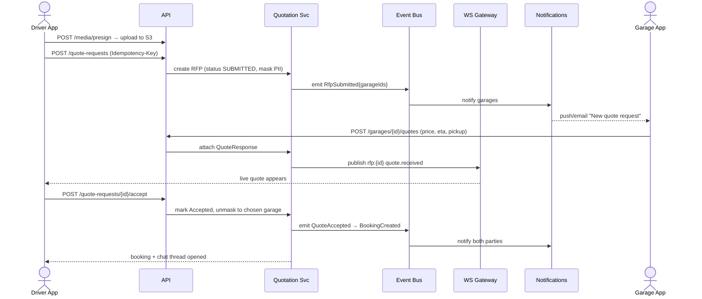

### 12.2 Media upload (presigned, moderated)

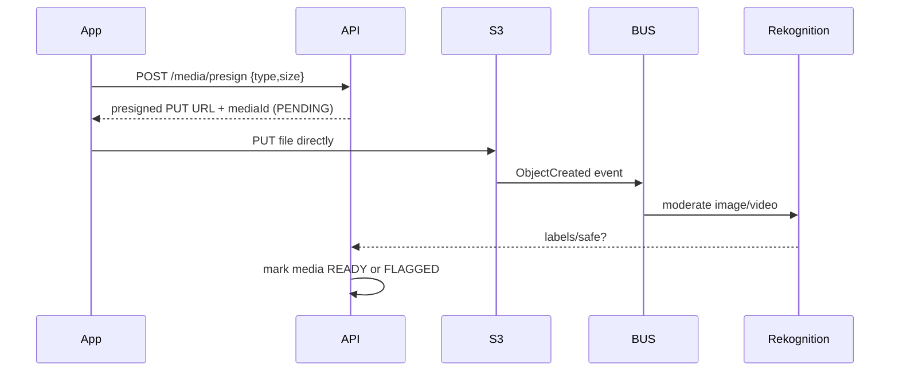

### 12.3 Booking completion → escrow release

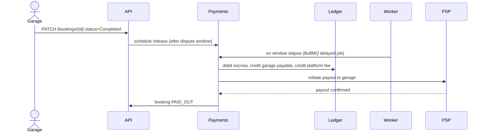

### 12.4 Parts Order — supplier fulfilment → payout

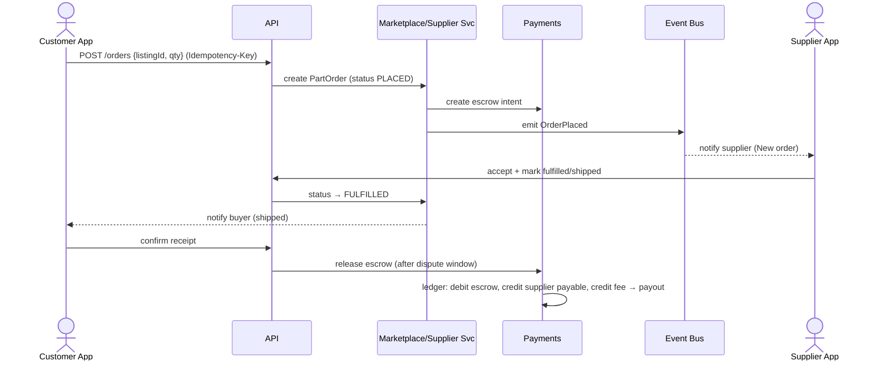

### 12.5 Insurance — network + claim decision

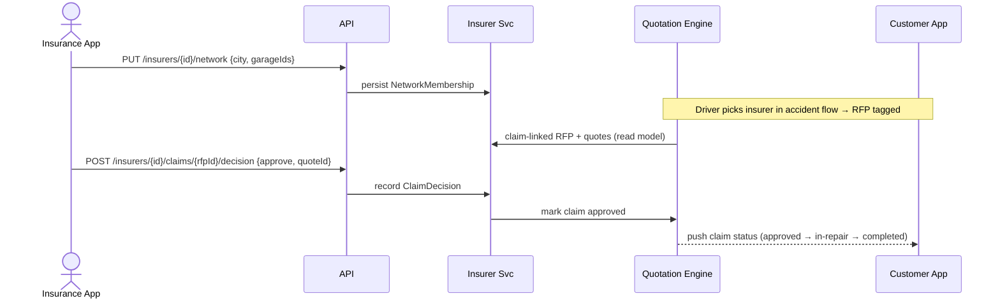

### 12.6 Garage — conflict resolve / suggest alternate time

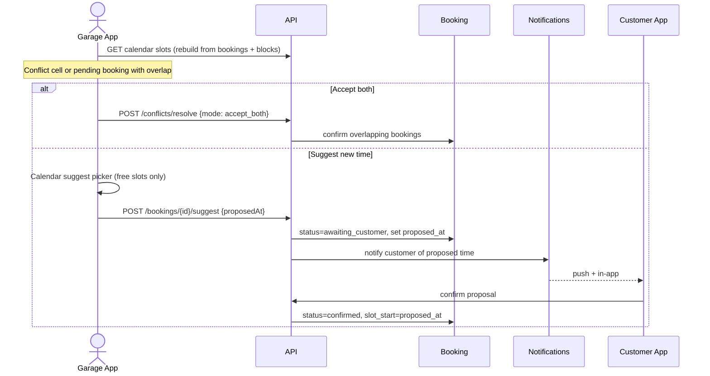

Pure client helpers already live in the garage prototype (`src/domain/availability.ts`, `bookingMachine.ts`) for RN reuse.

---

## 13. 🔎 Search & Geo-Discovery

- **Primary store:** PostgreSQL + PostGIS for authoritative geo (`ST_DWithin` radius, `ST_Distance` sort).
- **Search index:** OpenSearch mirrors garages (and parts) via CDC/event sync for **ranked, filtered, geo** queries at scale.
- **Ranking signals:** distance, rating & review count, response-time SLA, win-rate/completion, verification tier, "open now" (computed from `operating_hours` + local time).
- **Map pins:** clustered client-side; color by rating band.
- **Parts fitment:** index `make/model/year` compatibility; boost exact fitment for the selected vehicle.

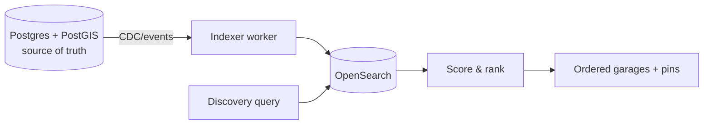

---

## 14. 💬 Realtime & Chat Architecture

**Decision:** Start with a **self-hosted WebSocket gateway** (NestJS + Redis pub/sub adapter) to avoid per-message vendor cost and keep chat data in our DB; **abstract behind an interface** so we can swap to a managed provider (Stream/Twilio Conversations / AWS AppSync) if scale demands. *(See ADR-4.)*

- **Transport:** WebSocket (WSS) via ALB → WS gateway on Fargate; Redis pub/sub for horizontal fan-out across instances.
- **Persistence:** messages in Postgres (`THREAD`, `MESSAGE`); media via presigned S3.
- **Features:** per-garage threads, typing indicators, timestamps, delivery/read receipts, after-hours auto-reply (rule from garage hours), image upload.
- **Presence:** Redis TTL keys per connection.
- **Offline:** push notification on undelivered message; history hydrated on reconnect.

---

## 15. 🖼️ Media Pipeline

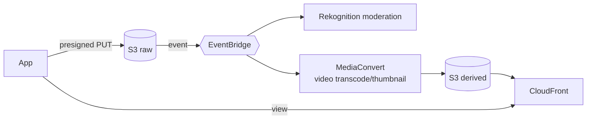
- Direct-to-S3 presigned uploads (no bytes through API).
- Image/video content moderation via Rekognition before publish.
- Thumbnails + transcoding for video; CDN delivery; signed URLs for private media (e.g., accident photos).
- Limits enforced (≤10 files; JPEG/PNG/MP4) at API + client.

---

## 16. 💳 Payments, Escrow & Ledger

**PSP abstraction** (`PaymentProvider` interface) with adapters — **Checkout.com / Tap / Telr** for MENA cards, **Stripe** where applicable, **Tabby/Tamara** for BNPL. Apple Pay, Mada, STC Pay supported through PSP.

**Escrow model**
1. Driver pays → funds **captured/held** (escrow account in ledger).
2. Job completed → **dispute window** (e.g., 48h) via BullMQ delayed job.
3. Window elapses / dispute resolved → **release**: garage payable + platform fee via double-entry postings, then PSP payout.

**Correctness guarantees**
- **Idempotency-Key** on intent creation; PSP webhooks verified (signature) and idempotent.
- **Double-entry ledger** — every movement balances; ledger is source of truth, PSP is mirror; daily reconciliation job.
- **PCI scope minimized** (SAQ-A): card data never touches our servers (PSP-hosted fields/tokens).

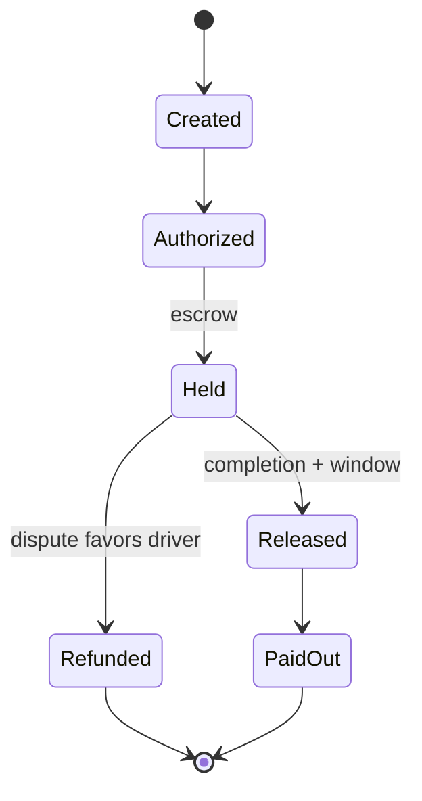

---

## 17. 🔔 Notifications

- **Channels:** Push (FCM/APNs via Pinpoint/SNS), SMS/WhatsApp (Twilio/Unifonic), Email (SES), In-app.
- **Trigger model:** domain events on the bus → Notification service → channel routing by user preference + locale.
- **Templates:** localized (EN/AR platform MVP; garage UI already 6 locales), versioned; transactional priority queue vs. marketing.
- **Reliability:** retries with backoff via SQS DLQ; delivery logged.
- **Garage in-app inbox (prototype):** derived client-side from pending bookings, today's reminders, new quote RFPs, and unanswered reviews (`src/domain/notifications.ts`); read-state persisted locally until server preferences exist.

| Event | Channels |
|---|---|
| OTP | SMS |
| Quote received | Push + in-app |
| Booking confirmed/reschedule / suggested time | Push + email + in-app |
| Chat message (offline) | Push |
| Payout processed | Push + email |
| Garage approval | Push + email |
| Pending booking / unanswered review (garage) | In-app (prototype) → push when API lands |

---

## 18. 🔐 Authentication & Authorization

- **AuthN:** email+password (Argon2 hashing), mobile OTP (rate-limited, TTL codes), Google OAuth2/OIDC. Access JWT (short-lived) + rotating refresh token (httpOnly / secure storage). Optional migration path to **Cognito**.
- **AuthZ:** **RBAC + ABAC**. Roles map to the five apps: `driver` (Customer), `garage_owner` / `garage_staff` (Garage), `supplier_owner` / `supplier_staff` (Supplier), `insurer_admin` / `insurer_agent` (Insurance), `admin` / `moderator` (Admin). Attribute checks enforce isolation (e.g., a garage only sees RFPs it's targeted in; a supplier only sees its own orders; an insurer only sees quotes tied to its policyholders; masked fields gated until `accepted`).
- **Sessions:** device binding, revoke-all on password change, refresh rotation with reuse detection.

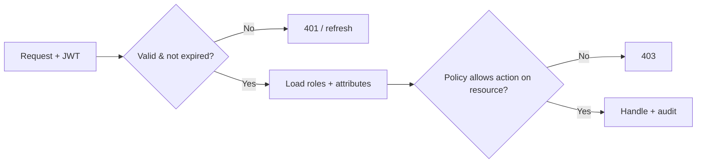

---

## 19. 🛡️ Security & Threat Model

**STRIDE-lite overview**

| Threat | Vector | Mitigation |
|---|---|---|
| **Spoofing** | Stolen tokens | Short JWT TTL, refresh rotation + reuse detection, device binding |
| **Tampering** | Payload/webhook forgery | Signed PSP webhooks, request validation, WAF |
| **Repudiation** | Disputed actions | Append-only audit log, immutable ledger |
| **Info disclosure** | PII leak in RFP | Masking projections, field-level authz, encryption at rest |
| **DoS** | API flooding | Rate limiting (Redis), WAF, autoscaling, per-key quotas |
| **Elevation** | Broken authz | Central policy layer, deny-by-default, tests per role |
| **Fraud** | Fake accounts/reviews/claims | Velocity/device checks, payout holds, anomaly detection |

**Baseline:** TLS 1.2+ everywhere; encryption at rest (KMS) for RDS/S3/OpenSearch; secrets in Secrets Manager; least-privilege IAM; VPC with private subnets for data tier; OWASP ASVS L2; dependency & container scanning in CI; PII data-retention & erasure jobs (PDPL).

---

## 20. 📈 Observability

- **Tracing:** OpenTelemetry across API/WS/workers → AWS X-Ray / Grafana Tempo; `traceId` in every error & log.
- **Metrics:** Prometheus/CloudWatch — RED (rate/errors/duration) per module + business metrics (fill-rate, time-to-first-quote, payout latency).
- **Logs:** structured JSON → CloudWatch/OpenSearch; PII-scrubbed.
- **Dashboards:** service health + **Ops liquidity board** (real-time marketplace KPIs from PRD §6).
- **Alerting:** SLO burn-rate alerts (see below) → PagerDuty/Slack.

### SLOs
| Service | SLO |
|---|---|
| Core booking/quote API availability | 99.9% |
| P95 read latency | < 400 ms |
| Quote real-time delivery | < 2 s p95 |
| Payment webhook processing | < 5 s p95, 0 lost |
| Notification delivery | 99% within 30 s |

---

## 21. 🚀 Scalability & Performance

- **Stateless services** on Fargate with target-tracking autoscaling (CPU + request count).
- **Caching:** Redis for hot garage profiles, discovery results (short TTL), session; CDN for media & static.
- **DB scaling:** RDS Multi-AZ + **read replicas** for discovery/analytics reads; connection pooling (PgBouncer/RDS Proxy).
- **Search offload:** heavy discovery/parts queries served by OpenSearch, not Postgres.
- **Async offload:** notifications, media, payouts, indexing via queues → protect request path.
- **Future partitioning:** when needed, shard high-volume tables (messages, ledger, events) by time/tenant; extract Quotation, Chat, Payments into standalone services (seams already drawn).
- **Hot-path budget:** discovery and RFP submission are latency-critical → cache + index + precomputed rankings.

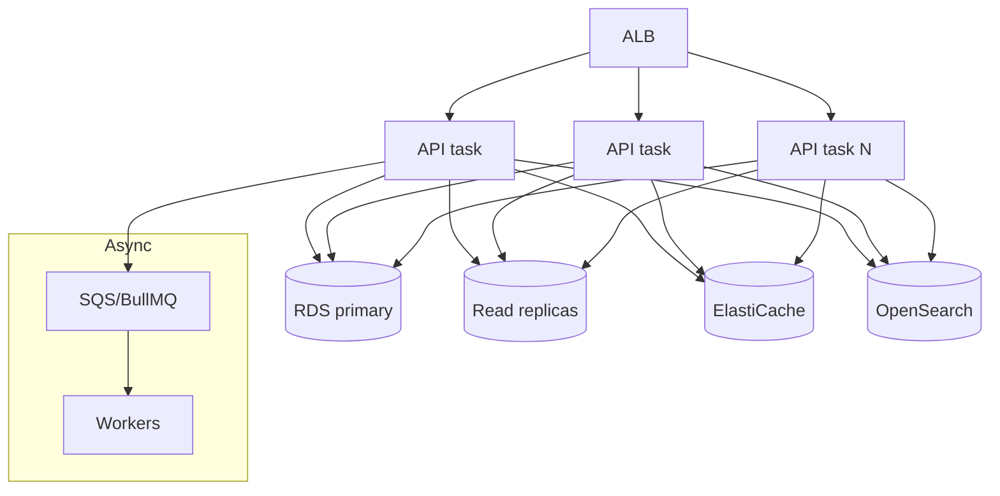

---

## 22. ☁️ AWS Infrastructure & DevOps

### Reference Architecture

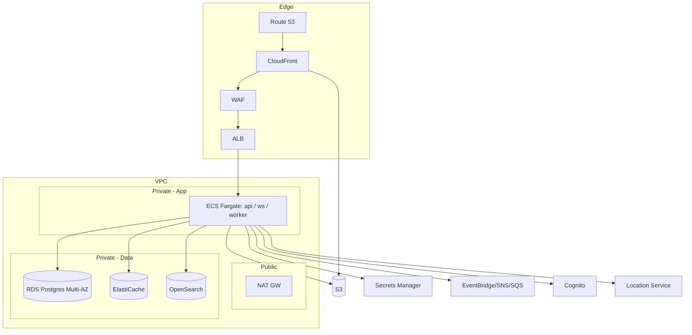

### Environments & CI/CD
- **Envs:** `dev` → `staging` → `prod`, isolated accounts/VPCs.
- **IaC:** Terraform modules (network, data, compute, observability).
- **CI/CD (GitHub Actions):** lint + typecheck + test → build → push to **ECR** → deploy to **ECS** via **CodeDeploy blue/green** (auto-rollback on alarm). RN apps via **EAS Build** + OTA updates.
- **DB migrations:** Prisma migrate gated in pipeline, backward-compatible (expand/contract).
- **Feature flags:** (LaunchDarkly/self-hosted) for phased rollouts & module toggles (chat/recovery/payments per PRD admin settings).

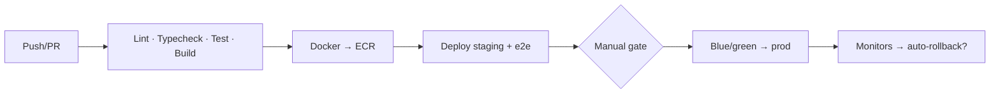

---

## 23. 📊 Data & Analytics Platform

```mermaid
graph LR
    App -->|events| API
    API --> Firehose[Kinesis Firehose]
    Firehose --> Lake[(S3 Data Lake)]
    Lake --> Glue[Glue catalog]
    Glue --> Athena[Athena / Redshift]
    Athena --> BI[Dashboards / Metabase]
    Lake --> ML[Future: AI damage-estimator training set]
```
- Product events (PRD §16 taxonomy) → Firehose → S3 lake → Athena/Redshift → BI.
- **Strategic:** the accumulating **damage-photo + repair-price + outcome** dataset becomes the training corpus for the Phase-2 **AI Damage Estimator** — a compounding data moat. Capture it cleanly from day one (labeled, consented, partitioned).

---

## 24. 🌍 Multi-Region & Data Residency

- **MVP:** single primary region — **AWS Middle East (UAE) `me-central-1`** for latency + residency; Multi-AZ for HA; cross-region backups for DR (defined RPO/RTO).
- **Design for expansion:** `country_code` partitioning, config-driven insurers/tax/currency, ability to pin data per country as regulations require (KSA/Egypt).
- **DR:** automated RDS snapshots, S3 versioning + replication, IaC enables region rebuild; documented runbook.

---

## 25. 🧪 Testing Strategy

| Layer | Approach | Target |
|---|---|---|
| Unit | Jest — domain logic (state machines, pricing, validation) | ≥ 80% on `packages/domain` |
| Integration | Supertest + Testcontainers (Postgres/Redis) | Critical paths |
| Contract | OpenAPI schema tests; consumer-driven | No client/server drift |
| E2E | Playwright (web) + Detox (RN) | Golden journeys: quote, book, pay, chat |
| Load | k6 — discovery, RFP submit, chat fan-out | Meet SLOs at 2× target |
| Security | SAST/DAST, dependency & container scan, secrets scan | In CI, block on high |
| Chaos (later) | Fault injection on workers/queues | Resilience |

Golden E2E flows mirror PRD journeys §9: onboarding→first booking, accident RFP→accept, parts purchase, garage onboarding→quote→win.

---

## 26. 💵 Cost Envelope (Indicative)

| Stage | Monthly AWS (rough) | Notes |
|---|---|---|
| MVP / beta (1 city) | low four-figure USD | 2–3 Fargate tasks each tier, small RDS Multi-AZ, small OpenSearch, S3/CF |
| Growth (multi-city) | mid four-figure USD | Autoscale tasks, read replicas, larger cache/search |
| Scale (multi-country) | five-figure+ USD | Reserved/Savings Plans, per-country data, heavier analytics |

Cost controls: Savings Plans/Reserved for steady compute, S3 lifecycle tiering, right-sized OpenSearch, cache to cut DB load, budget alerts.

---

## 27. ⚖️ Alternatives & Trade-offs (ADRs)

| ADR | Decision | Alternatives | Why |
|---|---|---|---|
| **ADR-1** | **Modular monolith first**, service-seams pre-drawn | Full microservices from day 1 | Faster MVP, lower ops overhead; extract when scale/team demand — avoids premature distribution |
| **ADR-2** | **NestJS** backend | Express bare, Fastify-only, Serverless-only | Modular DI maps to bounded contexts; clean extraction path; TS-first |
| **ADR-3** | **REST + thin GraphQL BFF** | Pure REST / pure GraphQL | REST simple & cacheable; GraphQL only where mobile screens need aggregation |
| **ADR-4** | **Self-host chat** behind interface | Managed (Stream/Twilio/AppSync) from start | Own data + cost control at MVP; swap-ready if scale demands |
| **ADR-5** | **Prisma** ORM (+ raw SQL/PostGIS) | TypeORM, Knex, raw | DX, type-safety, migrations; drop to SQL for geo |
| **ADR-6** | **ECS Fargate** | EKS, Lambda-only | Simplicity vs. Kubernetes ops; predictable for long-lived WS |
| **ADR-7** | **React Native (Expo)** | Native Swift/Kotlin, Flutter | Mandated React reuse; shared logic; OTA velocity |
| **ADR-8** | **Double-entry ledger in Postgres** | PSP-as-truth, event-sourced ledger | Auditable correctness for escrow; simpler than full ES at MVP |
| **ADR-11** | **MUI 7 MD3 for Garage web prototype** | Tailwind/`@gogaragi/ui-web` from day 1 | Ships Garage OS UX quickly against Visily MD3 samples; converge to shared token package later without rewriting domain logic |
| **ADR-9** | **`me-central-1` single region** | Multi-region active-active | Residency + latency; complexity deferred |
| **ADR-10** | **Separate repo per client app** (customer / garage / supplier / insurance / admin) + backend + shared-packages repo | Single monorepo (Nx/Turborepo) | Independent team ownership, release cadence & CI/CD; smaller blast radius; per-app access control (e.g., insurer & supplier code isolated). Shared code via **published, versioned packages** (CodeArtifact) + automated dependency PRs (Renovate) + changesets releases. Accepts cross-repo coordination overhead in exchange for autonomy |

---

## 28. 🧭 Engineering Milestones

```mermaid
gantt
    title Engineering delivery (aligned to PRD phases)
    dateFormat YYYY-MM-DD
    axisFormat %b
    section Foundation
    Repos (5 apps+backend+shared), registry, CI/CD, IaC, auth :e1, 2026-08-01, 30d
    section Vertical slices
    Identity + Vehicle + Discovery            :e2, after e1, 25d
    Quotation Engine (RFP + realtime)         :e3, after e1, 45d
    Booking + Calendar + Notifications        :e4, after e2, 30d
    Chat (WS)                                 :e5, after e2, 20d
    Garage + Admin apps                       :e6, after e2, 40d
    Supplier app + Parts catalog/orders       :e6b, after e2, 40d
    Insurance app (network + claim quotes)    :e6c, after e3, 35d
    Payments + Escrow + Ledger (garage+supplier):e7, after e4, 30d
    section Hardening
    Security, load test, observability, beta  :e8, after e7, 25d
    UAE MVP launch                            :milestone, after e8, 0d
    section Phase 2
    Parts GA · Recovery · BNPL · AI estimator :e9, after e8, 90d
    Insurer claim decisioning + status API    :e9b, after e8, 45d
```

**Team shape (indicative):** 2–3 backend, 3 frontend (1 RN-lean for Customer; 2 web sharing the four React dashboards via the common `@gogaragi/ui-web` package), 1 full-stack/BFF, 1 DevOps/SRE (shared), 1 QA, 1 designer, 1 PM. Because the four web apps share a design system and API client, they don't need four separate teams at MVP — the shared packages let a small web crew own all four repos. Lean, AI-assisted delivery model.

---

## 29. ❓ Open Questions
1. **Chat build-vs-buy** trigger threshold (concurrent connections/cost) — revisit at beta.
2. **PSP + payout rails** final selection for UAE (settlement timing, KYC for garages).
3. **OTP/SMS provider** (Twilio vs Unifonic) for MENA deliverability & WhatsApp.
4. **Cognito vs self-managed** auth — lock before Foundation phase ends.
5. **Insurer integration** depth for MVP (network-publish only vs. read quotes).
6. **Data residency** obligations per launch country — confirm with legal.

---

## 30. 📎 Appendix

### Non-Functional → Technical mapping
| PRD NFR | RFC realization |
|---|---|
| P95 < 400 ms | Cache + OpenSearch + read replicas + Fargate autoscale |
| 99.9% availability | Multi-AZ RDS, ≥2 tasks/tier, blue-green, health checks |
| PII masking | Authz-gated projections in Quotation Engine |
| PCI SAQ-A | PSP-hosted card fields, tokenization, no PAN storage |
| RTL/AR | i18next + NativeWind/Tailwind RTL (platform); garage prototype uses Emotion + stylis-plugin-rtl |
| Multi-locale garage UI | i18next resources EN/AR/ES/FR/RU/DE under `src/i18n/locales/` |
| Observability | OpenTelemetry + CloudWatch/X-Ray + SLO alerts |

### Garage web prototype — as-built map

| Concern | Location in `go-garagi-garages` |
|---|---|
| Web mount | `/gogaragi-garage/` (`vite` `base` + React Router `basename`) |
| Garage API mount | `/gogaragi-garage/api/` → `server/modules/garage` (Express; Nest `GarageModule` later) |
| Shared path constants | `shared/appPaths.ts` |
| Domain (RN-ready) | `src/domain/` — types, `bookingMachine`, `availability`, `notifications`, `format` |
| Seed / demo data | `src/data/seed.ts` (Al Quoz Auto Care) |
| Client store | `src/store/useGarageStore.ts` (Zustand persist `go-garagi-garage-v6`) |
| API client | `src/api/garageClient.ts` |
| Screens | `src/features/*` |
| i18n | `src/i18n/` + language persist `go-garagi-lang` |
| Theme | `src/theme/md3Theme.ts` |
| UI samples | `Docs/Sample Screens/` |
| Demo login | `khalid@alquozgarage.ae` / `demo1234` |

### Glossary
| Term | Meaning |
|---|---|
| **Modulith** | Modular monolith with clean bounded-context seams |
| **BFF** | Backend-for-Frontend (GraphQL aggregation layer) |
| **RFP** | Sealed accident quote request (PRD flagship flow) |
| **CDC** | Change Data Capture (Postgres → OpenSearch sync) |
| **ADR** | Architecture Decision Record |
| **SLO/SLI** | Service Level Objective / Indicator |
| **AwaitingCustomer** | Booking waiting on customer to accept garage-proposed time |
| **Conflict slot** | Calendar cell with overlapping active bookings |

### Traceability
Each PRD epic `GG-E#` maps to a domain module in §7; user stories `US-###` are realized by the endpoints in §11 and flows in §12. Garage prototype stories US-082–088 map to `src/features/` until BFF wiring.

<div align="center">

---

**End of RFC — Go Garagi v1.1**
*Companion product spec: `Go_Garagi_PRD.md`*

</div>
